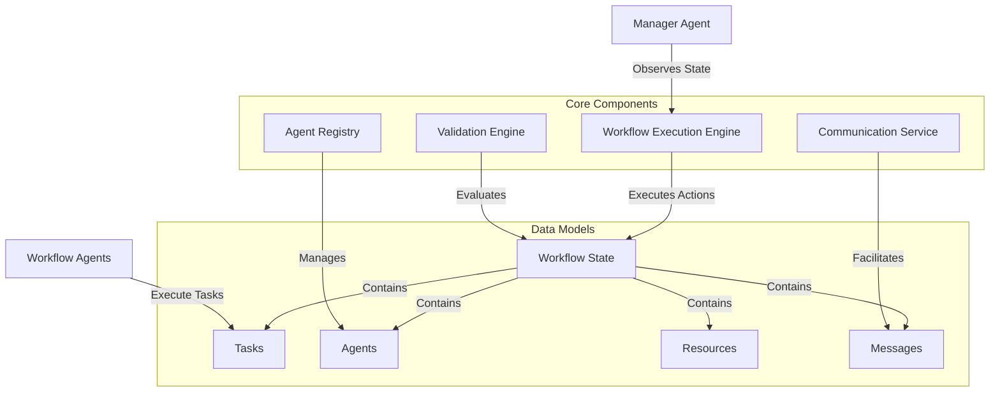

# Manager Agent Gym - Technical Architecture

*Deep dive into the system architecture, design patterns, and implementation details*

## 🏗️ System Overview

Manager Agent Gym implements a **Partially Observable Stochastic Game (POSG)** framework for autonomous workflow management. The system consists of multiple layers working together to provide a complete research platform for evaluating AI managers.



## 🎯 POSG Framework Implementation

### Formal Definition

The system implements `⟨I, S, b⁰, {Aᵢ}, {Oᵢ}, P, {Rᵢ}⟩` where:

| Component | Implementation | Description |
|-----------|----------------|-------------|
| **I** | `ManagerAgent` + `AgentInterface` | Set of agents (manager + workers) |
| **S** | `Workflow` | Complete state space |
| **b⁰** | Initial `Workflow` | Initial belief state |
| **Aᵢ** | `BaseManagerAction` hierarchy | Action spaces per agent |
| **Oᵢ** | `ManagerObservation` | Observation spaces |
| **P** | `WorkflowExecutionEngine` | State transition function |
| **Rᵢ** | `ValidationEngine` | Reward functions |

### State Space Design

```python
class Workflow(BaseModel):
    """Core POSG state representation"""
    
    # Identity and goals
    id: UUID
    name: str
    workflow_goal: str
    
    # POSG state components
    tasks: dict[UUID, Task]           # G: Task graph
    resources: dict[UUID, Resource]   # R: Resource registry  
    agents: dict[str, AgentInterface] # W: Worker agents
    messages: list[Message]           # C: Communication history
    
    # Constraints and governance
    constraints: list[Constraint]
    
    # Execution state
    total_cost: float
    total_simulated_hours: float
    is_active: bool
```

## 🧠 Manager Agent Architecture

### Design Pattern: Strategy + Observer

Manager agents follow a strategy pattern with observational capabilities:

```python
class ManagerAgent(ABC):
    """Abstract manager agent interface"""
    
    @abstractmethod
    async def step(
        self,
        workflow: Workflow,
        execution_state: ExecutionState,
        current_timestep: int,
        # ... additional context
    ) -> BaseManagerAction:
        """RL-style step function returning next action"""
        pass
    
    def on_action_executed(
        self,
        timestep: int,
        action: BaseManagerAction,
        action_result: ActionResult | None,
    ) -> None:
        """Callback for action result feedback"""
        pass
```

### Structured Manager Implementation

The `ChainOfThoughtManagerAgent` uses LLM-based structured reasoning:

```python
class ChainOfThoughtManagerAgent(ManagerAgent):
    """LLM-based manager with constrained action generation"""
    
    async def take_action(self, observation: ManagerObservation) -> BaseManagerAction:
        # 1. Build structured prompt with workflow context
        prompt = self._build_action_prompt(observation)
        
        # 2. Generate structured response with action constraints
        response = await generate_structured_response(
            prompt=prompt,
            response_model=self._action_constraint_schema,
            model=self.model_name
        )
        
        # 3. Use the validated action instance directly
        return response.action
```

**Key Features:**
- **Constrained Generation**: Uses Pydantic schemas to ensure valid actions
- **Multi-Step Reasoning**: Separates reasoning from action selection
- **Error Handling**: Graceful fallbacks for invalid actions
- **Context Management**: Efficient context windowing for large workflows

## 🔄 Execution Engine Architecture

### Design Pattern: Event-Driven State Machine

The execution engine follows an event-driven architecture with discrete timesteps:

```python
class WorkflowExecutionEngine:
    """Core execution loop managing POSG transitions"""
    
    async def execute_timestep(self) -> ExecutionResult:
        """Single timestep execution cycle"""
        
        # 1. Manager observation and action phase
        if self.manager_agent:
            manager_action = await self.manager_agent.step(
                workflow=self.workflow,
                # ... context
            )
            await manager_action.execute(self.workflow, self.communication_service)
        
        # 2. Task execution phase (parallel)
        tasks_started, tasks_completed, tasks_failed = await self._execute_ready_tasks()
        
        # 3. State update phase
        self._update_workflow_state(tasks_completed, tasks_failed)
        
        # 4. Evaluation phase
        evaluation_result = await self.validation_engine.evaluate_timestep(
            workflow=self.workflow,
            timestep=self.current_timestep,
            # ... context
        )
        
        return ExecutionResult(...)
```

### Concurrency Model

**Task Execution**: Tasks execute asynchronously within each timestep
**Manager Actions**: Synchronous within timestep, between task execution phases
**Evaluation**: Parallel rubric evaluation with semaphore-based concurrency control

```python
# Parallel task execution
async with TaskGroup() as tg:
    for task, agent in ready_assignments:
        tg.create_task(agent.execute_task(task, resources))

# Parallel evaluation with concurrency limits
async with asyncio.Semaphore(max_concurrent_rubrics):
    evaluation_tasks = [
        evaluate_rubric(rubric, context) 
        for rubric in active_rubrics
    ]
    results = await asyncio.gather(*evaluation_tasks)
```

## 👥 Agent System Architecture

### Design Pattern: Plugin Architecture + Registry

The agent system uses a plugin-based architecture with dynamic registration:

```python
class AgentRegistry:
    """Central registry for agent discovery and lifecycle management"""
    
    def __init__(self):
        self._agents: dict[str, AgentInterface] = {}
        self._agent_classes: dict[str, Type[AgentInterface]] = {}
        self._scheduled_changes: dict[int, list[ScheduledAgentChange]] = {}
    
    def create_agent(self, config: AgentConfig) -> AgentInterface:
        """Factory method for agent creation"""
        agent_class = self._agent_classes.get(config.agent_type)
        if agent_class is None:
            raise ValueError(f"Unknown agent type: {config.agent_type}")
        
        return agent_class(config)
```

### Agent Interface Design

```python
class AgentInterface(ABC, Generic[ConfigType]):
    """Base interface for all workflow agents"""
    
    @abstractmethod
    async def execute_task(
        self, task: Task, resources: list[Resource]
    ) -> ExecutionResult:
        """Core task execution interface"""
        pass
    
    def can_handle_task(self, task: Task) -> bool:
        """Capability and availability check"""
        return self.is_available and len(self.current_task_ids) < self.max_concurrent_tasks
```

### AI Agent Implementation

AI agents use the OpenAI Agents SDK with dependency injection:

```python
class AIAgent(AgentInterface[AIAgentConfig]):
    """LLM-based agent with structured tool usage"""
    
    def __init__(self, config: AIAgentConfig, tools: list[Tool]):
        self.openai_agent = Agent(
            model=LitellmModel(model=config.model_name),
            name=config.agent_id,
            instructions=config.system_prompt,
            tools=tools + COMMUNICATION_TOOLS,  # DI: Communication tools
            output_type=AITaskOutput,
        )
    
    async def execute_task(self, task: Task, resources: list[Resource]) -> ExecutionResult:
        # Create execution context for dependency injection
        context = AgentExecutionContext(
            communication_service=self.communication_service,
            agent_id=self.config.agent_id,
            current_task_id=task.id,
            tool_event_sink=self.record_tool_use_event,
        )
        
        # Execute with DI context
        result = await Runner.run(
            self.openai_agent,
            task_prompt,
            context=context,  # 🎯 DI magic happens here!
        )
        
        return self._process_result(result)
```

## 📊 Evaluation System Architecture

### Design Pattern: Strategy + Composite

The evaluation system uses a composite pattern for hierarchical evaluation:

```python
class ValidationEngine:
    """Stateless per-timestep evaluator"""
    
    async def evaluate_timestep(
        self,
        workflow: Workflow,
        timestep: int,
        preferences: PreferenceWeights | None = None,
        workflow_evaluators: list[Evaluator] | None = None,
    ) -> EvaluationResult:
        """Evaluate workflow state against all criteria"""
        
        # 1. Collect all rubrics from preferences and workflow evaluators
        scheduled_rubrics = self._collect_rubrics(preferences, workflow_evaluators)
        
        # 2. Execute rubrics in parallel with concurrency control
        rubric_results = await self._execute_rubrics_parallel(
            scheduled_rubrics, workflow, timestep
        )
        
        # 3. Aggregate results hierarchically
        preference_scores = self._aggregate_preference_scores(rubric_results)
        
        # 4. Calculate reward signal
        reward_value = self._calculate_reward(preference_scores)
        
        return EvaluationResult(...)
```

### Rubric Evaluation Strategies

**Code-based Rubrics**: Direct Python function evaluation
```python
def quality_validator(context: ValidationContext) -> EvaluatedScore:
    """Custom validation logic"""
    score = evaluate_quality_metrics(context.workflow)
    return EvaluatedScore(score=score, reasoning="Quality assessment based on...")
```

**LLM-based Rubrics**: Structured LLM evaluation
```python
class WorkflowValidationRule:
    """LLM-based workflow evaluation"""
    
    async def _llm_validate(self, context: ValidationContext) -> ValidationResult:
        validation_prompt = f"""
        You are evaluating workflow performance on: {self.llm_prompt}
        
        Workflow Context: {self._prepare_workflow_context(context)}
        
        Return a score in [0, {self.max_score}] with reasoning.
        """
        
        response = await generate_structured_response(
            prompt=validation_prompt,
            response_model=LLMScoredResponse,
            model=self.model
        )
        
        return self._process_llm_response(response)
```

## 🔄 Communication System Architecture

### Design Pattern: Mediator + Event Bus

The communication system uses a mediator pattern for agent coordination:

```python
class CommunicationService:
    """Central communication hub for all agents"""
    
    def __init__(self):
        self._message_store: list[Message] = []
        self._subscribers: dict[str, list[Callable]] = {}
    
    async def send_message(
        self,
        sender_id: str,
        recipient_id: str,
        content: str,
        message_type: MessageType = MessageType.DIRECT,
        cc_list: list[str] | None = None,
    ) -> UUID:
        """Send message with automatic routing and storage"""
        
        message = Message(
            id=uuid4(),
            sender_id=sender_id,
            recipient_id=recipient_id,
            content=content,
            message_type=message_type,
            timestamp=datetime.now(),
            cc_list=cc_list or [],
        )
        
        self._message_store.append(message)
        await self._notify_subscribers(message)
        
        return message.id
```

### Dependency Injection for Tools

Communication tools are injected into agents via execution context:

```python
@tool
async def send_message_to_agent(
    recipient_id: str,
    message: str,
    ctx: RunContext[AgentExecutionContext],
) -> str:
    """Tool for agents to send messages"""
    
    message_id = await ctx.deps.communication_service.send_message(
        sender_id=ctx.deps.agent_id,
        recipient_id=recipient_id,
        content=message,
    )
    
    return f"Message sent successfully (ID: {message_id})"
```

## 🗄️ Data Model Architecture

### Design Pattern: Domain-Driven Design

Data models are organized by domain with clear boundaries:

```
schemas/
├── core/                    # Core POSG entities
│   ├── workflow.py             # Workflow aggregate root
│   ├── tasks.py               # Task entities and value objects
│   ├── resources.py           # Resource entities
│   └── communication.py      # Message entities
├── execution/              # Runtime execution models
│   ├── state.py              # Execution state machines
│   ├── manager_actions.py    # Manager action hierarchy
│   └── callbacks.py          # Event handling models
├── preferences/            # Preference and evaluation domain
│   ├── preference.py         # Preference entities
│   ├── evaluator.py          # Evaluation configuration
│   └── rubric.py            # Rubric specifications
└── workflow_agents/        # Agent configuration domain
    ├── config.py             # Agent configuration models
    └── outputs.py           # Agent output specifications
```

### Hierarchical Task Model

Tasks support hierarchical decomposition with dependency propagation:

```python
class Task(BaseModel):
    """Hierarchical task with dependency management"""
    
    # Core identity
    id: UUID
    name: str
    description: str
    status: TaskStatus
    
    # Hierarchy support
    subtasks: list["Task"] = Field(default_factory=list)
    dependency_task_ids: list[UUID] = Field(default_factory=list)
    
    # Assignment and execution
    assigned_agent_id: str | None = None
    estimated_duration_hours: float | None = None
    estimated_cost: float | None = None
    
    def is_atomic_task(self) -> bool:
        """Check if task is a leaf node"""
        return len(self.subtasks) == 0
    
    def get_atomic_subtasks(self) -> list["Task"]:
        """Get all atomic descendants"""
        if self.is_atomic_task():
            return [self]
        
        atomic_tasks = []
        for subtask in self.subtasks:
            atomic_tasks.extend(subtask.get_atomic_subtasks())
        return atomic_tasks
    
    def is_ready_to_start(self, completed_task_ids: set[UUID]) -> bool:
        """Check if all dependencies are satisfied"""
        return all(
            dep_id in completed_task_ids 
            for dep_id in self.dependency_task_ids
        )
```

## 🔧 Configuration and Extensibility

### Configuration Management

The system uses Pydantic Settings for configuration:

```python
class Settings(BaseSettings):
    """Global configuration settings"""
    
    # API keys
    OPENAI_API_KEY: str = Field(..., description="OpenAI API key")
    ANTHROPIC_API_KEY: str = Field("", description="Optional Anthropic API key")
    
    # Model defaults
    DEFAULT_MODEL_NAME: str = Field("gpt-4o", description="Default LLM model")
    MAX_CONCURRENT_RUBRICS: int = Field(100, description="Max parallel evaluations")
    
    # Output settings
    BASE_OUTPUT_DIR: str = Field("outputs", description="Base output directory")
    SAVE_WORKFLOW_SNAPSHOTS: bool = Field(True, description="Save workflow states")
    
    class Config:
        env_file = ".env"
        env_prefix = "MAG_"
```

### Plugin System

The system supports extensions through plugin interfaces:

```python
# Custom manager agent
class CustomManagerAgent(ManagerAgent):
    async def take_action(self, observation: ManagerObservation) -> BaseManagerAction:
        # Custom decision logic
        return action

# Register with factory
def create_manager_agent(preferences: PreferenceWeights, manager_mode: str) -> ManagerAgent:
    if manager_mode == "custom":
        return CustomManagerAgent(preferences)
    # ... existing modes
```

## 🧪 Testing Architecture

### Testing Strategy

**Unit Tests**: Component isolation with mocking
```python
@pytest.fixture
def mock_workflow():
    return create_test_workflow_with_dependencies()

async def test_manager_action_execution(mock_workflow):
    action = AssignTaskAction(task_id=task_id, agent_id=agent_id)
    result = await action.execute(mock_workflow, mock_communication_service)
    assert result.success
```

**Integration Tests**: End-to-end workflow execution
```python
async def test_complete_workflow_execution():
    workflow = create_test_workflow()
    engine = WorkflowExecutionEngine(...)
    results = await engine.run_full_execution()
    assert workflow.is_complete()
```

**Property-Based Testing**: Invariant checking
```python
@given(st.workflow_graphs())
def test_task_graph_validity(workflow):
    assert workflow.validate_task_graph()
```

## 🚀 Performance Considerations

### Scalability Patterns

**Concurrency**: Parallel task execution and evaluation
**Batching**: Rubric evaluation batching with progress tracking
**Caching**: LLM response caching for repeated evaluations
**Memory Management**: Circular buffers for action history

### Performance Monitoring

```python
class PerformanceTracker:
    """Track execution performance metrics"""
    
    def __init__(self):
        self.timestep_durations: list[float] = []
        self.llm_token_usage: dict[str, int] = {}
        self.evaluation_times: list[float] = []
    
    @contextmanager
    def track_timestep(self):
        start_time = time.time()
        yield
        self.timestep_durations.append(time.time() - start_time)
```

## 🔒 Error Handling and Resilience

### Error Handling Strategy

**Graceful Degradation**: Continue execution on non-critical failures
**Circuit Breakers**: Prevent cascade failures in LLM calls
**Retry Logic**: Exponential backoff for transient failures
**Fallback Actions**: Default behaviors when action parsing fails

```python
class ResilientManagerAgent(ManagerAgent):
    async def take_action(self, observation: ManagerObservation) -> BaseManagerAction:
        try:
            return await self._generate_action(observation)
        except LLMInferenceTruncationError:
            # Fallback to simpler observation
            simplified_obs = self._simplify_observation(observation)
            return await self._generate_action(simplified_obs)
        except Exception as e:
            logger.warning(f"Action generation failed: {e}")
            return self._fallback_action(observation)
```

## 📈 Monitoring and Observability

### Structured Logging

```python
# Contextual logging with structured data
logger.info(
    "Manager action executed",
    extra={
        "timestep": timestep,
        "action_type": action.__class__.__name__,
        "workflow_id": workflow.id,
        "execution_time_ms": execution_time * 1000,
    }
)
```

### Metrics Collection

**Execution Metrics**: Timestep duration, completion rates
**Cost Metrics**: Token usage, API costs
**Quality Metrics**: Evaluation scores, constraint violations
**Coordination Metrics**: Message frequency, agent utilization

## 🔮 Future Extensibility

### Planned Extensions

**Multi-Workflow Management**: Parallel workflow execution
**Real-Time Integration**: Live system integration capabilities
**Advanced Evaluation**: Learned evaluation functions
**Distributed Execution**: Multi-node execution support

### Extension Points

**Custom Actions**: Extend `BaseManagerAction` hierarchy
**Custom Agents**: Implement `AgentInterface` for specialized workers
**Custom Evaluators**: Add domain-specific evaluation rubrics
**Custom Communication**: Extend communication protocols

---

This technical architecture provides the foundation for building sophisticated autonomous workflow management systems while maintaining flexibility for research and practical applications.
