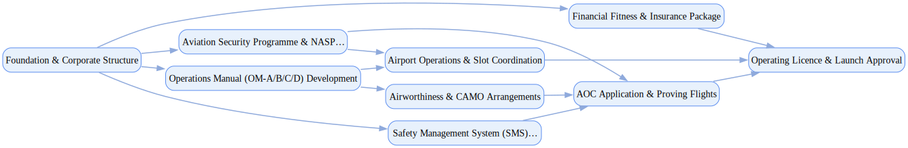

## Airline Launch Program

`tasks: 40` `constraints: 9` `team: 18` `timesteps: 35`

### Workflow Goal

!!! info "Objective"
    Objective: Execute a structured airline launch program in the UK, securing both the Air Operator Certificate
                (AOC) and Operating Licence (OL) from the Civil Aviation Authority (CAA), demonstrating compliance with
                aviation safety, airworthiness, security, economic, and consumer protection requirements, and achieving
                readiness for safe, reliable, and commercially viable operations.

??? note "Primary deliverables"
    - Approved Air Operator Certificate (AOC) with validated Operations Manuals (OM-A/B/C/D), Safety Management
    - System (SMS), Compliance Monitoring, and training records meeting UK Reg (EU) 965/2012 and ANO 2016.
    - Granted Operating Licence (OL) with evidence of UK principal place of business, majority ownership/control,
    - financial fitness, and binding insurance contracts compliant with Reg (EC) 785/2004.
    - Airworthiness approvals: Part-CAMO and Part-145 arrangements (in-house or contracted), Aircraft
    - Registration Certificates, Certificates of Airworthiness (CofA) and Airworthiness Review Certificates (ARC),
    - and reliability/maintenance programs.
    - Aviation security package: airline security programme approved under the National Aviation Security Programme
    - (NASP), staff vetting and training records, and use of government-approved screening equipment.
    - Dangerous goods (DG) approval (if applicable): CAA Form SRG2807 submission, DG training program approval,
    - and Ops Manual DG procedures integrated into compliance monitoring.
    - Insurance & liability package: binding certificates covering passenger, baggage, cargo, and third-party
    - liabilities with required minima.
    - Airport and slot access approvals: slot confirmations at coordinated airports (via ACL), handling contracts,
    - ground operations arrangements, and disruption management plan compliant with UK261 passenger rights.
    - Governance package: decision logs, proving flight records, CAA inspection findings and closures, executive
    - sign-offs, and board-approved readiness evidence.

??? success "Acceptance criteria (high-level)"
    - AOC issued with no unresolved CAA findings; proving flights and inspections completed successfully.
    - OL granted on demonstration of financial fitness, ownership/control, and compliant insurance coverage.
    - CAMO/Part-145 arrangements validated; ARC/CofA issued for all fleet aircraft; reliability and MEL/GMEL
    - programs approved.
    - Airline security programme accepted by CAA; 100% of relevant staff vetted and trained; compliance with
    - NASP evidenced.
    - Dangerous goods approval (where applicable) granted; DG procedures integrated into Ops Manual and training
    - records available.
    - Slots confirmed at intended airports; ground handling and disruption management plans signed off.
    - Formal sign-offs present from Accountable Manager, nominated postholders (Flight Ops, Ground Ops,
    - Continuing Airworthiness, Crew Training, Safety, Security), and Board of Directors.
    - Governance documentation demonstrates regulatory engagement, escalation handling, and final approval.
    - Constraints (soft):
    - Target horizon: complete certification and launch readiness in ≤ 12 weeks of simulated effort; avoid >7-day
    - stalls on critical-path milestones (AOC, OL, airworthiness approvals).
    - Budget guardrail: stay within ±20% of projected certification, legal, insurance, and operational setup costs
    - absent justified scope changes.
    - Transparency: prefer proactive disclosure of regulatory issues or resource gaps, with remediation and
    - mitigation plans, to maximize regulator trust and launch confidence.

### Team Structure

| Agent ID | Type | Name / Role | Capabilities |
|---|---|---|---|
| flight_operations_specialist | ai |  | Develops Operations Manual sections Develops flight procedures Develops crew training programs Develops operational control systems |
| safety_management_specialist | ai |  | Develops safety policy Develops risk management processes Develops safety assurance systems |
| airworthiness_manager | ai |  | Develops CAMO arrangements Develops Part-145 contracts Develops maintenance programs Develops continuing airworthiness management compliance |
| aviation_security_specialist | ai |  | Develops aviation security programmes Develops staff vetting Develops security training Develops screening equipment arrangements |
| regulatory_affairs_manager | ai |  | Coordinates AOC and Operating Licence applications Manages CAA liaison Manages inspection support Manages regulatory compliance activities |
| financial_compliance_analyst | ai |  | Prepares financial fitness documentation Secures insurance coverage Manages financial monitoring systems |
| airport_operations_coordinator | ai |  | Coordinates airport operations including slot management Coordinates ground handling contracts Coordinates disruption management plans Coordinates passenger rights compliance |
| training_standards_manager | ai |  | Develops OM-D training programs Develops competency standards Develops crew checking requirements Develops training delivery systems |
| caa_principal_inspector | human_mock | CAA Principal Inspector (Regulatory Authority) | Oversees AOC certification oversight Oversees inspection coordination Oversees regulatory approval decisions |
| chief_pilot | human_mock | Chief Pilot (Flight Operations Postholder) | Oversees flight operations oversight Oversees pilot training approval Oversees operational safety |
| head_of_safety | human_mock | Head of Safety (Safety Management Postholder) | Oversees SMS oversight Oversees safety risk management Oversees safety culture development |
| continuing_airworthiness_manager | human_mock | Continuing Airworthiness Manager (Airworthiness Postholder) | Oversees CAMO oversight Oversees airworthiness compliance |
| head_of_training | human_mock | Head of Training (Training Postholder) | Oversees crew training program oversight Oversees competency validation |
| security_manager | human_mock | Security Manager (Security Postholder) | Oversees aviation security programme and NASP compliance |
| ground_operations_manager | human_mock | Ground Operations Manager (Ground Operations Postholder) | Oversees ground operations oversight Oversees airport coordination |
| aviation_legal_counsel | human_mock | Aviation Legal Counsel (Legal Advisory) | Provides regulatory compliance advice Reviews contracts Manages legal risk |
| cfo_finance_director | human_mock | CFO/Finance Director (Financial Leadership) | Demonstrates financial fitness Arranges insurance Manages financial controls |
| accountable_manager | human_mock | Accountable Manager (Executive Leadership) | Provides ultimate responsibility for airline operations Ensures safety and regulatory compliance |

### Join/Leave Schedule

| Timestep | Agents / Notes |
|---:|---|
| 0 | **flight_operations_specialist** — Operations Manual development **safety_management_specialist** — SMS implementation **regulatory_affairs_manager** — Regulatory coordination and foundation |
| 5 | **airworthiness_manager** — CAMO and airworthiness arrangements **aviation_security_specialist** — Aviation security programme **financial_compliance_analyst** — Financial fitness and insurance |
| 10 | **training_standards_manager** — Training program development **airport_operations_coordinator** — Airport operations and slot coordination |
| 15 | **chief_pilot** — Flight operations oversight **head_of_safety** — Safety management oversight **continuing_airworthiness_manager** — Airworthiness oversight |
| 20 | **head_of_training** — Training program validation **security_manager** — Security programme oversight **ground_operations_manager** — Ground operations validation |
| 25 | **caa_principal_inspector** — CAA inspection and certification **aviation_legal_counsel** — Legal compliance review |
| 30 | **cfo_finance_director** — Financial fitness validation |
| 35 | **accountable_manager** — Final accountability and launch approval |

### Workflow Diagram

[{ width=1200 }](assets/airline_launch_program.svg){ target=_blank }

### Preferences & Rubrics

Defined: Yes.

#### Sources

- Workflow: `/Users/charliemasters/Desktop/deepflow/manager_agent_gym/examples/end_to_end_examples/airline_launch_program/workflow.py`
- Team: `/Users/charliemasters/Desktop/deepflow/manager_agent_gym/examples/end_to_end_examples/airline_launch_program/team.py`
- Preferences: `/Users/charliemasters/Desktop/deepflow/manager_agent_gym/examples/end_to_end_examples/airline_launch_program/preferences.py`

