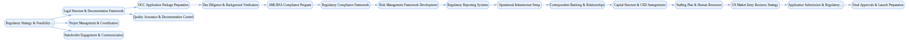

## Banking License Application

`tasks: 58` `constraints: 6` `team: 21` `timesteps: 35`

### Workflow Goal

!!! info "Objective"
    Objective: Execute comprehensive banking license application and US market entry strategy for European 
                mid-size commercial bank seeking to establish federal branch operations, including regulatory approvals, 
                operational readiness, and compliance framework implementation.

??? note "Primary deliverables"
    - Complete federal branch license application package (OCC Form, business plan, management profiles,
    - capital documentation) with supporting legal and financial documentation.
    - Comprehensive due diligence portfolio: beneficial ownership verification, AML/BSA compliance program,
    - customer identification procedures, and enhanced due diligence protocols.
    - Regulatory compliance framework: policies, procedures, and controls addressing Federal Reserve
    - Regulation K, OCC guidelines, and FDIC requirements with documented governance structure.
    - Operational readiness assessment: IT infrastructure, staffing plan, physical office setup,
    - correspondent banking relationships, and service delivery capabilities.
    - Risk management framework: credit risk policies, market risk controls, liquidity management
    - procedures, operational risk assessment, and regulatory reporting systems.
    - Stakeholder engagement strategy: regulator communication plan, legal counsel coordination,
    - consultant management, and internal executive alignment.
    - US market entry business plan: competitive analysis, target customer segments, product offerings,
    - revenue projections, and 3-year growth strategy.
    - Capital and funding structure: $50M minimum capital requirement, CED (Capital Equivalent Deposit)
    - arrangements, liquidity facilities, and ongoing funding sources.

??? success "Acceptance criteria (high-level)"
    - OCC preliminary and final approval obtained with all regulatory conditions satisfied; Federal Reserve
    - non-objection secured.
    - Home country regulator (ECB/national authority) approval for US market entry with comprehensive
    - supervision attestation.
    - Complete AML/BSA compliance program implemented with independent validation; no outstanding
    - regulatory concerns.
    - Operational infrastructure fully deployed and tested; correspondent banking relationships established
    - and operational.
    - Senior management team hired and background-checked; board governance framework established and
    - documented.
    - Capital requirements satisfied with funds deposited; FDIC insurance application approved (if applicable).

### Team Structure

| Agent ID | Type | Name / Role | Capabilities |
|---|---|---|---|
| regulatory_strategist | ai |  | Specializes in US banking regulations Specializes in OCC requirements Specializes in Federal Reserve coordination Specializes in multi-jurisdiction regulatory navigation |
| legal_counsel | ai |  | Focuses on banking law Focuses on regulatory compliance Focuses on corporate structure Focuses on legal documentation |
| compliance_specialist | ai |  | Specializes in AML/BSA programs Specializes in customer identification procedures Specializes in enhanced due diligence Specializes in US banking compliance framework implementation |
| risk_manager | ai |  | Specializes in credit risk policies Specializes in market risk controls Specializes in operational risk assessment Specializes in liquidity management |
| capital_structuring_analyst | ai |  | Manages $50M minimum capital requirements Manages CED arrangements Manages funding strategy Manages regulatory capital adequacy documentation |
| financial_analyst | ai |  | Prepares business plans Prepares financial projections Prepares market analysis Prepares revenue forecasting |
| operations_manager | ai |  | Responsible for operational readiness Responsible for IT infrastructure Responsible for correspondent banking relationships Responsible for physical office setup Responsible for service delivery capabilities |
| technology_architect | ai |  | Designs core banking systems Designs security infrastructure Designs regulatory reporting capabilities Designs IT compliance framework implementation |
| hr_specialist | ai |  | Manages staffing plans Manages senior management recruitment Manages background checks Manages training programs Manages human resources policy development |
| business_development_lead | ai |  | Develops US market entry strategy Develops competitive analysis Develops target customer segments Develops product offerings Develops growth strategy implementation |
| project_coordinator | ai |  | Manages overall project timeline Manages stakeholder coordination Manages milestone tracking Ensures regulatory approval process stays on 18-24 month timeline |
| occ_examiner | human_mock | OCC Bank Examiner (Federal Regulator) | Reviews federal branch license application for completeness and regulatory compliance |
| federal_reserve_supervisor | human_mock | Federal Reserve Supervisor (Central Bank Supervisor) | Coordinates international banking supervision and Regulation K compliance |
| home_country_regulator | human_mock | ECB Supervisor (Home Country Regulator) | Approves US market expansion and coordinates cross-border banking supervision |
| board_chair | human_mock | Board Chair (Board Leadership) | Provides strategic oversight and final board approval for US market entry initiative |
| chief_risk_officer | human_mock | Chief Risk Officer (Senior Risk Executive) | Validates risk management framework and ensures risk appetite alignment |
| chief_compliance_officer | human_mock | Chief Compliance Officer (Senior Compliance Executive) | Validates compliance framework and regulatory readiness |
| internal_audit_director | human_mock | Internal Audit Director (Internal Audit) | Reviews controls, governance, and process adequacy |
| external_legal_advisor | human_mock | External Legal Advisor (Banking Law Specialist) | Specializes in US banking law and regulatory applications |
| independent_consultant | human_mock | Independent Banking Consultant (Regulatory Consultant) | Provides objective review and regulatory expertise |
| third_party_validator | human_mock | Third-Party Validator (Independent Validator) | Conducts independent assessment of operational readiness and compliance |

### Join/Leave Schedule

| Timestep | Agents / Notes |
|---:|---|
| 0 | **regulatory_strategist** — Regulatory strategy and feasibility assessment **legal_counsel** — Legal structure and documentation framework **project_coordinator** — Project management and coordination **external_legal_advisor** — Legal advisory and regulatory guidance |
| 5 | **financial_analyst** — Business plan and financial documentation **compliance_specialist** — Due diligence and background verification **capital_structuring_analyst** — Capital structure planning |
| 10 | **home_country_regulator** — ECB/home supervisor coordination **independent_consultant** — Independent regulatory expertise |
| 15 | **risk_manager** — Risk management framework development **operations_manager** — Operational infrastructure planning **technology_architect** — IT systems and infrastructure |
| 20 | **hr_specialist** — Staffing and human resources **business_development_lead** — Market entry strategy **chief_risk_officer** — Risk framework validation |
| 25 | **occ_examiner** — OCC application review **federal_reserve_supervisor** — Federal Reserve coordination **chief_compliance_officer** — Compliance framework validation |
| 30 | **internal_audit_director** — Internal audit and controls review **third_party_validator** — Independent operational readiness validation |
| 35 | **board_chair** — Board oversight and final approval |

### Workflow Diagram

[{ width=1200 }](assets/banking_license_application.svg){ target=_blank }

### Preferences & Rubrics

Defined: Yes.

#### Sources

- Workflow: `/Users/charliemasters/Desktop/deepflow/manager_agent_gym/examples/end_to_end_examples/banking_license_application/workflow.py`
- Team: `/Users/charliemasters/Desktop/deepflow/manager_agent_gym/examples/end_to_end_examples/banking_license_application/team.py`
- Preferences: `/Users/charliemasters/Desktop/deepflow/manager_agent_gym/examples/end_to_end_examples/banking_license_application/preferences.py`

