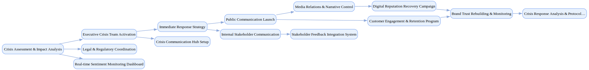

## Brand Crisis Management

`tasks: 40` `constraints: 6` `team: 16` `timesteps: 10`

### Workflow Goal

!!! info "Objective"
    Objective: Execute comprehensive brand crisis management response to social media-driven reputation incident affecting mid-market consumer goods company, coordinate multi-stakeholder communications, implement reputation recovery strategy, and restore customer trust to pre-crisis levels within 4-month timeline.

??? note "Primary deliverables"
    - Crisis assessment and stakeholder impact analysis with comprehensive situation evaluation, stakeholder mapping, sentiment analysis across digital platforms, and financial impact quantification with real-time monitoring dashboard.
    - Multi-channel crisis communication strategy with coordinated messaging framework across social media, traditional media, internal communications, and customer service channels with platform-specific content and media relations protocols.
    - Executive crisis team activation with cross-functional team deployment including executive leadership, PR specialists, legal counsel, HR representatives, and customer service leads with defined roles and 24/7 response capability.
    - Customer communication and engagement program with direct customer outreach campaigns, social media response protocols, customer service enhancement, compensation program development, and community management strategy.
    - Internal stakeholder management with employee communication plan, leadership messaging alignment, partner notifications, investor relations updates, and board reporting with morale monitoring.
    - Media relations and narrative control with press release development, interview preparation, journalist relationship management, and proactive media engagement with message consistency.
    - Digital reputation recovery campaign with SEO optimization, positive content creation, influencer engagement, customer testimonial programs, and online review management.
    - Legal and regulatory coordination with legal risk assessment, regulatory notification requirements, litigation preparedness, compliance verification, and documentation preservation.

??? success "Acceptance criteria (high‑level)"
    - Customer sentiment recovery to >75% of pre-crisis levels within 4 months; social media sentiment shifted from negative to neutral/positive across all platforms.
    - Media coverage balance achieved with 60% neutral-to-positive articles within 6 weeks; no unresolved factual inaccuracies in major media coverage.
    - Internal stakeholder confidence maintained with <5% employee turnover during crisis period; investor confidence preserved with transparent communication.
    - Legal and compliance requirements met with zero regulatory violations; all documentation properly maintained for potential legal proceedings.
    - Customer retention rate >90% among existing customer base; customer service resolution time <24 hours for crisis-related inquiries.
    - Brand trust metrics restored to within 80% of pre-crisis baseline through independent third-party measurement.

### Team Structure

| Agent ID | Type | Name / Role | Capabilities |
|---|---|---|---|
| crisis_communications_lead | ai |  | Develops messaging framework Develops multi-channel communication strategy Preserves brand voice during crisis |
| social_media_manager | ai |  | Handles real-time social media response Monitors sentiment Maintains platform consistency |
| stakeholder_relations_manager | ai |  | Manages customer retention Manages employee communications Manages investor relations Manages partner notifications |
| media_relations_specialist | ai |  | Handles traditional media relations Manages journalist relationships Coordinates spokesperson activities Controls narrative during crisis |
| crisis_analyst | ai |  | Conducts situation assessment Analyzes stakeholder impact Quantifies financial impact Evaluates competitive landscape |
| customer_service_coordinator | ai |  | Enhances customer service Develops crisis-specific scripts Implements customer retention and compensation programs |
| digital_reputation_manager | ai |  | Manages digital reputation recovery Optimizes SEO Creates positive content Manages online review management Engages influencers |
| crisis_legal_counsel | ai |  | Provides legal guidance during crisis Assesses risk Ensures regulatory compliance Prepares litigation |
| chief_executive_officer | human_mock | Chief Executive Officer (Executive Leadership) | Provides executive leadership Makes final decisions Represents the company externally |
| chief_marketing_officer | human_mock | Chief Marketing Officer (Brand Leadership) | Oversees brand protection Adjusts marketing strategy Manages reputation recovery efforts |
| chief_legal_officer | human_mock | Chief Legal Officer (Legal Leadership) | Ensures legal compliance Mitigates risk Meets regulatory requirements |
| public_relations_director | human_mock | Public Relations Director (External Communications) | Leads external communications Manages media strategy Coordinates spokesperson activities |
| human_resources_director | human_mock | Human Resources Director (Internal Stakeholder Management) | Manages internal communications Manages employee morale Manages workforce retention |
| investor_relations_director | human_mock | Investor Relations Director (Financial Communications) | Maintains investor confidence Provides transparent updates Manages financial communications |
| operations_director | human_mock | Operations Director (Business Continuity) | Ensures business continuity Manages supply chain stability Responds to operational crises |
| external_brand_consultant | human_mock | External Brand Consultant (Strategic Advisory) | Provides independent perspective Validates crisis strategy Expertise in reputation recovery |

### Join/Leave Schedule

| Timestep | Agents / Notes |
|---:|---|
| 0 | **crisis_communications_lead** — Crisis communications strategy **crisis_analyst** — Situation assessment and impact analysis **chief_executive_officer** — Executive crisis leadership **chief_marketing_officer** — Brand protection oversight |
| 2 | **social_media_manager** — Real-time social media response **media_relations_specialist** — Media relations and press response **public_relations_director** — External communications leadership |
| 4 | **stakeholder_relations_manager** — Multi-stakeholder coordination **customer_service_coordinator** — Customer service enhancement **crisis_legal_counsel** — Legal risk assessment **chief_legal_officer** — Legal compliance oversight |
| 6 | **human_resources_director** — Internal communications and employee relations **investor_relations_director** — Investor confidence management **operations_director** — Business continuity assurance |
| 10 | **digital_reputation_manager** — Digital reputation recovery **external_brand_consultant** — Strategic crisis advisory |

### Workflow Diagram

[{ width=1200 }](assets/brand_crisis_management.svg){ target=_blank }

### Preferences & Rubrics

Defined: Yes.

#### Sources

- Workflow: `/Users/charliemasters/Desktop/deepflow/manager_agent_gym/examples/end_to_end_examples/brand_crisis_management/workflow.py`
- Team: `/Users/charliemasters/Desktop/deepflow/manager_agent_gym/examples/end_to_end_examples/brand_crisis_management/team.py`
- Preferences: `/Users/charliemasters/Desktop/deepflow/manager_agent_gym/examples/end_to_end_examples/brand_crisis_management/preferences.py`

