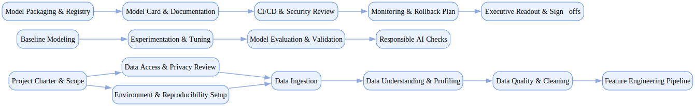

## Data Science Analytics

`tasks: 21` `constraints: 7` `team: 6` `timesteps: 50`

### Workflow Goal

!!! info "Objective"
    Objective: Deliver a production‑ready analytics/modeling solution for a business problem with
                high data quality, responsible‑AI controls, and reproducible results.

??? note "Primary deliverables"
    - Curated and governed dataset with documented lineage and quality checks
    - Feature pipeline and model artifacts with experiment tracking and seeds
    - Model card, bias/fairness analysis, and explainability report
    - Deployment package (CI/CD) with monitoring and rollback plan
    - Executive readout with business impact, risks, and next steps

??? success "Acceptance criteria (high‑level)"
    - Data privacy/PII policy compliance; secrets not present in artifacts
    - Reproducible training runs (fixed seeds, environment captured)
    - Minimum evaluation thresholds met (e.g., AUC/accuracy and calibration)
    - Bias/fairness metrics within policy thresholds and mitigations documented
    - Deployment readiness gate passed (security review + monitoring plan)

### Team Structure

| Agent ID | Type | Name / Role | Capabilities |
|---|---|---|---|
| data_engineer | ai |  | Ingestion pipelines Data quality checks Lineage documentation Data security |
| data_scientist | ai |  | Feature engineering Baseline modeling Experimentation |
| mlops_engineer | ai |  | Reproducibility CI/CD Packaging Monitoring |
| analytics_analyst | ai |  | KPI/ROI analysis Executive readouts |
| security_reviewer | human_mock | Security Reviewer (Security Review) | Dependency/secrets scans Deployment gate |
| risk_officer | human_mock | Risk Officer (Responsible AI Governance) | Fairness Explainability Governance |

### Join/Leave Schedule

| Timestep | Agents / Notes |
|---:|---|
| 0 | **data_engineer** — Ingestion & data quality **data_scientist** — Feature engineering & baseline |
| 10 | **mlops_engineer** — Reproducibility & experiment tracking |
| 20 | **analytics_analyst** — KPI analysis & readout drafting |
| 40 | **risk_officer** — RAI review: fairness & explainability |
| 50 | **security_reviewer** — Security review & deployment gate |

### Workflow Diagram

[{ width=1200 }](assets/data_science_analytics.svg){ target=_blank }

### Preferences & Rubrics

Defined: Yes.

#### Sources

- Workflow: `/Users/charliemasters/Desktop/deepflow/manager_agent_gym/examples/end_to_end_examples/data_science_analytics/workflow.py`
- Team: `/Users/charliemasters/Desktop/deepflow/manager_agent_gym/examples/end_to_end_examples/data_science_analytics/team.py`
- Preferences: `/Users/charliemasters/Desktop/deepflow/manager_agent_gym/examples/end_to_end_examples/data_science_analytics/preferences.py`

