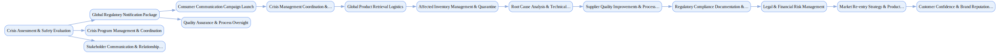

## Global Product Recall

`tasks: 49` `constraints: 6` `team: 24` `timesteps: 40`

### Workflow Goal

!!! info "Objective"
    Objective: Execute comprehensive global product recall for automotive safety component affecting 2M vehicles 
                across 15 countries, implement effective remediation measures, and achieve successful market re-entry with 
                restored consumer confidence and regulatory compliance.

??? note "Primary deliverables"
    - Global regulatory notification package: NHTSA, Transport Canada, EU GPSR, and national authority filings
    - with defect characterization, risk assessment, and coordinated timeline across all jurisdictions.
    - Crisis management coordination: cross-functional recall team activation, executive communication protocols,
    - regulatory liaison management, and 24/7 incident response capability with documented decision-making authority.
    - Consumer communication campaign: multi-channel safety notifications (mail, electronic, dealer networks),
    - customer service hotline deployment, media relations strategy, and social media crisis management with
    - regulatory-compliant messaging.
    - Product retrieval logistics: reverse supply chain activation, dealer network coordination, customer return
    - processing, affected inventory identification and quarantine, and disposal/recycling protocols across
    - global markets.
    - Root cause analysis and remediation: technical failure investigation, design modification development,
    - enhanced testing protocols, supplier quality improvements, and manufacturing process corrections with
    - validation evidence.
    - Regulatory compliance documentation: recall effectiveness monitoring, consumer response tracking
    - (targeting >95% completion), regulatory status reporting, and audit trail maintenance across all markets.
    - Market re-entry strategy: product redesign validation, regulatory approval for resumed sales, enhanced
    - quality assurance protocols, customer confidence rebuilding campaign, and competitive repositioning plan.
    - Legal and financial coordination: liability management across jurisdictions, insurance claims processing,
    - litigation strategy development, and financial impact mitigation with stakeholder communication.

??? success "Acceptance criteria (high-level)"
    - Recall completion rate >95% across all 15 markets with regulatory sign-offs obtained; no outstanding
    - critical safety findings.
    - Consumer safety incidents eliminated with zero additional injuries/fatalities post-recall announcement;
    - product hazard fully contained.
    - Regulatory approvals secured for market re-entry in all jurisdictions; enhanced quality protocols
    - validated and operational.
    - Customer confidence metrics restored to >80% of pre-recall levels within 12 months; brand reputation
    - recovery demonstrated through independent surveys.
    - Financial impact contained within crisis management budget parameters; insurance coverage maximized
    - and litigation exposure minimized.
    - Supply chain partners retained with enhanced quality agreements; dealer network confidence maintained
    - throughout process.

### Team Structure

| Agent ID | Type | Name / Role | Capabilities |
|---|---|---|---|
| crisis_coordinator | ai |  | Runs crisis operations cadence Coordinates emergency response Manages executive escalations Maintains decision/owner/ETA logs |
| safety_engineer | ai |  | Performs safety assessments Investigates failure modes Analyzes risk and mitigations Reports safety findings |
| quality_assurance_specialist | ai |  | Runs root cause analysis Implements design modifications Enhances testing protocols Improves supplier quality |
| regulatory_affairs_manager | ai |  | Coordinates multi‑jurisdiction filings Tracks timelines and dependencies Aligns with authorities Prepares regulator communications |
| compliance_coordinator | ai |  | Monitors recall effectiveness Tracks consumer responses Produces status reports Targets >95% completion |
| communications_director | ai |  | Runs crisis comms strategy Drafts consumer safety notifications Handles media relations Coordinates stakeholder communication |
| customer_service_manager | ai |  | Deploys hotlines and portals Runs return processing systems Tracks SLAs and satisfaction Feeds learnings to ops |
| logistics_coordinator | ai |  | Manages reverse logistics Coordinates dealer networks Plans retrieval across countries Resolves operational bottlenecks |
| supply_chain_manager | ai |  | Implements quarantine/disposal Coordinates suppliers Maintains partner relationships Audits process compliance |
| legal_counsel | ai |  | Assesses multi‑jurisdiction liability Guides litigation strategy Drafts legal communications Balances risk vs action |
| financial_analyst | ai |  | Manages crisis budget Processes insurance claims Tracks financial KPIs Models impact scenarios |
| brand_manager | ai |  | Designs confidence rebuilding campaigns Plans competitive repositioning Coordinates recovery communications Measures trust restoration |
| market_reentry_strategist | ai |  | Coordinates redesign validation Secures approvals for resumption Enhances QA protocols Stages re‑entry by market |
| nhtsa_examiner | human_mock | NHTSA Safety Examiner (US Safety Regulator) | Reviews defect reports Assesses recall effectiveness Issues findings/requirements Coordinates with manufacturer |
| transport_canada_official | human_mock | Transport Canada Official (Canadian Safety Regulator) | Coordinates Canadian approvals Monitors compliance Communicates updates Engages with stakeholders |
| eu_gpsr_coordinator | human_mock | EU GPSR Coordinator (European Safety Regulator) | Oversees EU coordination Validates compliance Tracks status across markets Aligns messaging and actions |
| ceo | human_mock | Chief Executive Officer (Executive Leadership) | Sets crisis priorities Communicates to stakeholders Approves major decisions Allocates resources |
| chief_safety_officer | human_mock | Chief Safety Officer (Safety Leadership) | Oversees safety protocols Validates corrective actions Tracks incidents Approves safety sign‑offs |
| general_counsel | human_mock | General Counsel (Legal Leadership) | Approves legal strategy Manages liability exposure Coordinates multi‑jurisdiction issues Oversees documentation |
| chief_financial_officer | human_mock | Chief Financial Officer (Financial Leadership) | Approves crisis budget Tracks financial impact Optimizes insurance/claims Reports to board and regulators |
| independent_safety_auditor | human_mock | Independent Safety Auditor (Independent Validation) | Validates remediation effectiveness Runs independent checks Issues findings Recommends improvements |
| insurance_adjuster | human_mock | Insurance Adjuster (Insurance Representative) | Processes claims Coordinates with insurers Documents coverage decisions Advises finance on recovery |
| consumer_advocacy_representative | human_mock | Consumer Advocacy Representative (Consumer Protection) | Represents consumer interests Validates effectiveness measures Provides feedback to improve Monitors outreach quality |
| board_chair | human_mock | Board Chair (Board Governance) | Chairs crisis board sessions Approves major crisis actions Ensures governance documentation Holds executives accountable |

### Join/Leave Schedule

| Timestep | Agents / Notes |
|---:|---|
| 0 | **crisis_coordinator** — Crisis management coordination **safety_engineer** — Immediate safety assessment **regulatory_affairs_manager** — Emergency regulatory notifications **ceo** — Executive crisis authority |
| 1 | **communications_director** — Crisis communication strategy **legal_counsel** — Legal risk assessment **chief_safety_officer** — Safety oversight authority |
| 3 | **customer_service_manager** — Customer service infrastructure **compliance_coordinator** — Regulatory compliance monitoring **general_counsel** — Legal strategy approval |
| 5 | **nhtsa_examiner** — US regulatory review **transport_canada_official** — Canadian regulatory coordination **eu_gpsr_coordinator** — European regulatory oversight |
| 8 | **logistics_coordinator** — Global logistics coordination **supply_chain_manager** — Supply chain operations **financial_analyst** — Financial impact management |
| 12 | **quality_assurance_specialist** — Root cause analysis **chief_financial_officer** — Financial oversight |
| 20 | **independent_safety_auditor** — Independent safety validation **insurance_adjuster** — Insurance claims processing **consumer_advocacy_representative** — Consumer protection oversight |
| 30 | **brand_manager** — Brand recovery strategy **market_reentry_strategist** — Market re-entry planning |
| 40 | **board_chair** — Board governance and final approvals |

### Workflow Diagram

[{ width=1200 }](assets/global_product_recall.svg){ target=_blank }

### Preferences & Rubrics

Defined: Yes.

#### Sources

- Workflow: `/Users/charliemasters/Desktop/deepflow/manager_agent_gym/examples/end_to_end_examples/global_product_recall/workflow.py`
- Team: `/Users/charliemasters/Desktop/deepflow/manager_agent_gym/examples/end_to_end_examples/global_product_recall/team.py`
- Preferences: `/Users/charliemasters/Desktop/deepflow/manager_agent_gym/examples/end_to_end_examples/global_product_recall/preferences.py`

