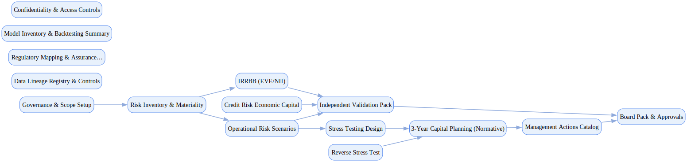

## Icap

`tasks: 39` `constraints: 9` `team: 11` `timesteps: 85`

### Workflow Goal

!!! info "Objective"
    Objective: Execute the annual ICAAP to provide a coherent, well‑governed, and evidence‑backed assessment of
                capital adequacy across economic and normative perspectives for a mid‑size EU retail bank.

??? note "Primary deliverables"
    - Comprehensive risk inventory and materiality assessment (credit, market/CVA/IRRBB, liquidity, operational,
    - concentration, model risk) with quantification methods and owners.
    - Economic capital computation with sensitivity analysis and consistency checks across models.
    - Institution‑wide stress testing (baseline/adverse/severe) and reverse stress testing with severity rationale.
    - 3‑year normative capital plan (CET1 vs OCR+CBR, P2R/P2G, MDA) and management buffer sizing.
    - Management actions catalog with feasibility, triggers, timelines, and quantified impacts.
    - Governance package: decision logs, committee materials, sign‑offs, and escalation evidence.
    - Regulatory mapping (PRA/ECB/CRD/CRR, Basel) with proportionality rationale and explicit gaps.
    - Data lineage registry and reproducibility notes for all key figures and workpapers.

??? success "Acceptance criteria (high‑level)"
    - Evidenced scenario coverage incl. reverse stress; decision‑impact analysis documented.
    - Sign‑offs present for validation, compliance, internal audit, and board pack.
    - Consistency between economic/normative perspectives with reconciliations where required.
    - Confidential information redacted with documented access controls; no unresolved high‑risk issues pending.

### Team Structure

| Agent ID | Type | Name / Role | Capabilities |
|---|---|---|---|
| credit_risk_modeler | ai |  | Builds PD/LGD/EAD estimates Analyzes concentration risk Computes economic capital Documents sensitivity and overlays |
| irrbb_analyst | ai |  | Measures EVE/NII sensitivities Calibrates behavioral assumptions Checks policy limit compliance Prepares IRRBB reports |
| op_risk_analyst | ai |  | Analyzes loss data Runs scenario assessments Applies model risk overlays Drafts ORSA/ICAAP write‑ups |
| stress_testing_designer | ai |  | Builds baseline/adverse/severe paths Designs reverse stress tests Documents variable books Preps governance review decks |
| capital_planner | ai |  | Projects earnings/RWAs/CET1 Assesses OCR+CBR and P2R/P2G Runs MDA checks Drafts management actions |
| documentation_lead | ai |  | Compiles CAS/risk coverage Links evidence and version control Tracks approvals Ensures submission readiness |
| model_validation_lead | human_mock | Model Validation Lead (Independent Validation) | Reviews methodology/data Runs outcomes analysis Designs monitoring Documents effective challenge |
| regulatory_compliance_officer | human_mock | Compliance Officer (Regulatory Compliance) | Maps rules to controls Reviews alignment and gaps Advises on remediation Tracks regulator interactions |
| internal_audit_reviewer | human_mock | Internal Audit Reviewer (Internal Audit) | Performs process/control audits Tests documentation completeness Issues findings/follow‑ups Confirms remediation effectiveness |
| board_committee | human_mock | Board Committee (Board Approval) | Challenges assumptions and results Balances risk appetite and buffers Approves final decisions Holds management accountable |
| bank_cfo | stakeholder | Bank CFO (Executive Stakeholder) | Sets compliance/time/cost priorities Approves buffer policy and actions Chairs decision forums Owns final submission call |

### Join/Leave Schedule

| Timestep | Agents / Notes |
|---:|---|
| 0 | **credit_risk_modeler** — Credit risk economic capital **irrbb_analyst** — IRRBB EVE/NII **op_risk_analyst** — Operational risk scenarios **documentation_lead** — Documentation assembly |
| 15 | **stress_testing_designer** — Scenario design |
| 40 | **capital_planner** — Normative projections and buffers |
| 70 | **model_validation_lead** — Independent validation **regulatory_compliance_officer** — Regulatory review |
| 85 | **internal_audit_reviewer** — Internal audit review **board_committee** — Final approval |

### Workflow Diagram

[{ width=1200 }](assets/icap.svg){ target=_blank }

### Preferences & Rubrics

Defined: Yes.

#### Sources

- Workflow: `/Users/charliemasters/Desktop/deepflow/manager_agent_gym/examples/end_to_end_examples/icap/workflow.py`
- Team: `/Users/charliemasters/Desktop/deepflow/manager_agent_gym/examples/end_to_end_examples/icap/team.py`
- Preferences: `/Users/charliemasters/Desktop/deepflow/manager_agent_gym/examples/end_to_end_examples/icap/preferences.py`

