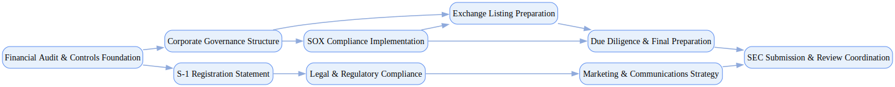

## Ipo Readiness Program

`tasks: 26` `constraints: 9` `team: 17` `timesteps: 30`

### Workflow Goal

!!! info "Objective"
    Objective: Execute a structured IPO readiness program to prepare a mid-size growth company for listing on a
                U.S. exchange, ensuring financial, governance, disclosure, and operational requirements are met and evidenced
                for SEC review, underwriter diligence, and investor confidence.

??? note "Primary deliverables"
    - S-1 registration statement with complete narrative (Business, Risk Factors, MD&A, Executive Compensation, Legal Proceedings) and financials compliant with Regulation S-X (audited, age-appropriate periods).
    - PCAOB-audited financial statements with reconciliations, non-GAAP disclosure controls, and comfort letter readiness for underwriters.
    - Corporate governance package: independent directors, audit/comp committees, charters, board minutes, and Rule 10A-3 compliance mapped to NYSE/Nasdaq standards.
    - Internal controls documentation: disclosure controls & procedures (SOX 302) and ICFR roadmap; 404(b) readiness if applicable; management certification process rehearsed.
    - Risk management and disclosure register: comprehensive inventory of operational, financial, legal, and cyber risks with consistent mapping to S-1 risk factors.
    - Legal and compliance artifacts: Staff Legal Bulletin No. 19-compliant legal/tax opinions, comfort letter request lists, and EDGAR submission workflows tested.
    - Marketing and communications plan: counsel-approved quiet-period strategy, test-the-waters (if EGC), IR playbook with Reg FD safeguards, and post-pricing disclosure controls.
    - Listing requirements checklist with market value/shareholder distribution tests, exchange approval correspondence, and evidence of auditor PCAOB registration.

??? success "Acceptance criteria (high-level)"
    - S-1 accepted for review by SEC with ≤2 major comment letter cycles; all Reg S-K and Reg S-X disclosures evidenced and traceable to supporting workpapers.
    - Independent board committees in place and certified as meeting NYSE/Nasdaq standards; committee minutes and charters filed.
    - Audit sign-offs completed; comfort letters available; management SOX 302 certifications rehearsed.
    - Legal and tax opinions filed; EDGAR test submissions validated without error codes.
    - Comms plan operational with documented legal pre-clearance; no material "gun-jumping" incidents.
    - Constraints (soft):
    - Target horizon: complete readiness within ≤ 8 weeks of simulated effort; no >5-day stalls on critical path (financial statements, governance formation, S-1 drafting).
    - Budget guardrail: stay within ±20% of planned legal/audit/consulting costs absent justified scope changes.
    - Transparency: prefer candid disclosure of known material weaknesses or risks, paired with remediation plans, over concealment to maximize SEC and investor confidence.

### Team Structure

| Agent ID | Type | Name / Role | Capabilities |
|---|---|---|---|
| financial_controller | ai |  | Coordinates PCAOB audit requests Owns financial statements and tie‑outs Manages non‑GAAP reconciliation Tracks disclosure consistency |
| securities_lawyer | ai |  | Drafts/edits S‑1 and exhibits Guides disclosure and quiet period Coordinates SEC comments/responses Maintains rule compliance mapping |
| governance_specialist | ai |  | Designs board/committee structures Implements independence standards Aligns with NYSE/Nasdaq rules Prepares governance disclosures |
| sox_compliance_manager | ai |  | Implements SOX controls and testing Builds disclosure controls & procedures Tracks deficiencies and remediation Prepares certification packages |
| audit_coordinator | ai |  | Manages audit PBCs and schedules Coordinates comfort letter process Ensures opinion quality and readiness Resolves auditor information gaps |
| edgar_specialist | ai |  | Prepares/validates EDGAR submissions Coordinates filing timing and checks Maintains submission audit trail Resolves XBRL/formatting issues |
| disclosure_analyst | ai |  | Drafts MD&A and risk factors Runs materiality assessments Aligns KPIs across disclosures Maintains issue/decision logs |
| investor_relations_lead | ai |  | Designs IR strategy and quiet‑period ops Preps roadshow and messaging controls Tracks Reg FD compliance Coordinates comms sign‑offs |
| external_auditor_lead | human_mock | External Auditor Lead (PCAOB Audit Partner) | Plans and executes PCAOB audits Issues comfort letters and opinions Reviews controls and adjustments Coordinates with audit committee |
| sec_legal_counsel | human_mock | SEC Legal Counsel (Securities Law Expert) | Advises on SEC rules and process Coordinates comment letter responses Reviews disclosures and exhibits Manages regulator communications |
| lead_independent_director | human_mock | Lead Independent Director (Board Governance) | Oversees governance structure build‑out Chairs independence/committee checks Coordinates board policy approvals Interfaces with audit committee |
| audit_committee_chair | human_mock | Audit Committee Chair (Financial Expert) | Oversees SOX readiness Reviews auditor independence Approves remediation plans Grants audit sign‑off |
| underwriter_legal_counsel | human_mock | Underwriter Counsel (Underwriter Legal) | Leads due‑diligence and Q&A Coordinates with auditors on comforts Reviews offering documents Advises on marketing restrictions |
| exchange_listing_specialist | human_mock | Exchange Listing Specialist (Exchange Relations) | Runs listing standards checklist Coordinates with exchange reviewers Tracks documentation and timelines Flags gaps for remediation |
| internal_audit_director | human_mock | Internal Audit Director (Internal Audit) | Performs control testing and QA Reviews documentation sufficiency Issues findings and follow‑ups Advises on process improvements |
| chief_financial_officer | human_mock | Chief Financial Officer (Executive Leadership) | Owns certification readiness Aligns finance, audit, and governance Approves offering economics Chairs financial sign‑off gates |
| company_ceo | stakeholder | Company CEO (Executive Stakeholder) | Sets timing and readiness standards Arbitrates scope vs schedule vs risk Approves external messaging posture Holds teams accountable to gates |

### Join/Leave Schedule

| Timestep | Agents / Notes |
|---:|---|
| 0 | **financial_controller** — Financial audit foundation **securities_lawyer** — S-1 registration preparation **governance_specialist** — Board structure establishment **audit_coordinator** — PCAOB audit coordination |
| 8 | **sox_compliance_manager** — SOX compliance implementation **disclosure_analyst** — Risk factor and MD&A preparation |
| 15 | **edgar_specialist** — EDGAR filing preparation **external_auditor_lead** — External audit execution |
| 20 | **sec_legal_counsel** — SEC legal review **lead_independent_director** — Board governance oversight |
| 25 | **audit_committee_chair** — Audit committee approval **investor_relations_lead** — Communications strategy |
| 28 | **underwriter_legal_counsel** — Due diligence coordination **exchange_listing_specialist** — Listing standards verification |
| 30 | **internal_audit_director** — Internal controls validation **chief_financial_officer** — Executive certification |

### Workflow Diagram

[{ width=1200 }](assets/ipo_readiness_program.svg){ target=_blank }

### Preferences & Rubrics

Defined: Yes.

#### Sources

- Workflow: `/Users/charliemasters/Desktop/deepflow/manager_agent_gym/examples/end_to_end_examples/ipo_readiness_program/workflow.py`
- Team: `/Users/charliemasters/Desktop/deepflow/manager_agent_gym/examples/end_to_end_examples/ipo_readiness_program/team.py`
- Preferences: `/Users/charliemasters/Desktop/deepflow/manager_agent_gym/examples/end_to_end_examples/ipo_readiness_program/preferences.py`

