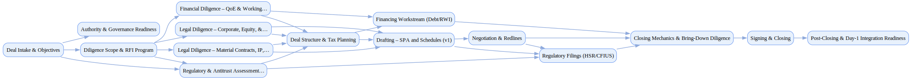

## Legal M And A

`tasks: 17` `constraints: 5` `team: 24` `timesteps: 55`

### Workflow Goal

!!! info "Objective"
    Objective: Coordinate end-to-end legal workstreams for a mid-market tech acquisition and
                reach signing/closing within ~90 days while preserving key customer relationships and
                minimizing regulatory risk.

??? note "Primary deliverables"
    - SPA drafts and a redline history with change rationales and crisp decision memos Evidence-linked disclosure schedules and consent lists mapped to diligence artifacts HSR submission (and CFIUS notice if elected) with waiting-period tracking and mitigations Funds-flow, sources/uses, signature packets, and a complete closing set with bring-down plan Risk register, RAID log, weekly status cadence, and board/committee approvals

??? success "Acceptance criteria (aligned with evaluators)"
    - Drafting completeness/consistency across SPA core sections with coherent fallback ladders Disclosure schedules are precise, current, and cite supporting evidence from the data room Funds-flow and closing set are execution-ready; bring-down confirmations planned HSR/CFIUS filings prepared and submitted as required; third-party consents actively managed Governance artifacts captured; no hard gating items outstanding at close Team alignment (see team configuration and timeline):
    - AI agents: deal_counsel_ai, diligence_reader, schedules_builder, redline_explainer, antitrust_analyst, cfius_analyst, tax_structuring_ai, funds_flow_coordinator, closing_checklist_manager, project_coordinator Human roles: lead_mna_partner, senior_mna_associate, regulatory/ip/privacy/employment/finance counsel, tax_partner, rwi_broker, acquirer GC/CFO, target CEO Preference dynamics emphasize early momentum (speed), then raise quality and compliance as signing approaches.

### Team Structure

| Agent ID | Type | Name / Role | Capabilities |
|---|---|---|---|
| deal_counsel_ai | ai |  | Drafts and negotiates SPA sections Tracks redline deltas with rationales Maintains issue lists with fallbacks Harmonizes definitions across documents |
| diligence_reader | ai |  | Extracts facts into structured index Flags risk‑relevant findings Links evidence to schedules Maintains citations and versions |
| schedules_builder | ai |  | Builds disclosure schedules Cross‑references to SPA Validates precision and currency Tracks exceptions and evidence |
| redline_explainer | ai |  | Summarizes deltas and rationale Identifies give‑gets Proposes trade packages Balances value/certainty/compliance |
| antitrust_analyst | ai |  | Analyzes HSR thresholds Assembles Item 4(c)/(d) materials Tracks waiting periods and requests Preps remedy discussion points |
| cfius_analyst | ai |  | Screens for CFIUS sensitivities Drafts short‑form notices Maintains Q&A coordination Interfaces with outside counsel |
| tax_structuring_ai | ai |  | Models asset/stock/merger options Prepares 338(h)(10)/336(e) analyses Drafts annotated step plans Checks dependencies |
| rwi_packager | ai |  | Assembles underwriting packets Tracks diligence responses Reconciles exclusions Aligns with SPA allocation |
| funds_flow_coordinator | ai |  | Prepares sources‑and‑uses Drafts funds‑flow statements Validates wires and certificates Coordinates signing/closing |
| closing_checklist_manager | ai |  | Maintains master checklist Verifies consents and CPs Manages sign packets Runs bring‑down confirmations |
| project_coordinator | ai |  | Runs issue/RFI/decision trackers Publishes weekly summaries Surfaces risks with owners/ETAs Maintains artifact consistency |
| lead_mna_partner | human_mock | Lead M&A Partner (External Counsel – Lead) | Sets negotiation strategy Approves deal trade‑offs Ensures board/executive alignment Signs legal positions and escalations |
| senior_mna_associate | human_mock | Senior M&A Associate (External Counsel – Associate) | Drafts SPA and ancillary documents Coordinates disclosure schedules Runs diligence calls Prepares decision memos |
| regulatory_counsel | human_mock | Regulatory Counsel (Antitrust/HSR) | Advises HSR thresholds and filings Coordinates with regulators Plans remedies discussions Aligns regulatory timelines |
| ip_counsel | human_mock | IP Counsel (Intellectual Property) | Validates IP ownership and OSS usage Drafts IP/OSS and assignment schedules Approves IP‑related covenants Manages IP risks and exceptions |
| privacy_counsel | human_mock | Privacy Counsel (Privacy & Security) | Assesses DPAs and transfers Aligns privacy representations Tracks exceptions and remediation Coordinates with security/legal |
| employment_counsel | human_mock | Employment Counsel (Labor & Employment) | Designs retention/offer schemes Advises on WARN/consultation duties Reviews restrictive covenant scope Preps employee comms |
| finance_counsel | human_mock | Finance Counsel (Debt & Finance) | Aligns debt commitment papers Coordinates intercreditor terms Preps closing deliverables Drafts solvency certificates |
| tax_partner | human_mock | Tax Partner (Tax) | Advises on structure selection Models elections and impacts Drafts tax provisions Validates rollover/earnout metrics |
| rwi_broker | human_mock | RWI Broker (Insurance Broker) | Coordinates underwriting calls Negotiates policy terms/exclusions Aligns RWI with SPA risk allocation Prepares binders |
| acquirer_gc | human_mock | General Counsel (Stakeholder – Legal) | Sets legal risk appetite Confirms governance and approvals Escalates trade‑offs to executives/board Grants final sign‑offs |
| acquirer_cfo | human_mock | Chief Financial Officer (Stakeholder – Finance) | Approves funds‑flow and WC mechanics Reviews valuation adjustments Oversees post‑close reporting Aligns finance risks and controls |
| target_ceo | human_mock | Target CEO (Target Leadership) | Coordinates leadership transition Approves disclosure schedule accuracy Supports customer transition Leads employee communications |
| acquirer_gc_stakeholder | stakeholder | Acquirer GC (Stakeholder) (Executive Stakeholder) | Sets priorities across phases Approves key trade‑offs Demands evidence‑linked schedules Grants final legal approval |

### Join/Leave Schedule

| Timestep | Agents / Notes |
|---:|---|
| 0 | **project_coordinator** — Stand up IM/trackers and weekly cadence **lead_mna_partner** — Establish negotiation strategy and governance **senior_mna_associate** — Drafting support and diligence coordination **diligence_reader** — Spin up dataroom triage and risk extraction **deal_counsel_ai** — Draft SPA v0 scaffold aligned to structure **acquirer_gc** — Stakeholder alignment and sign‑off authority |
| 6 | **ip_counsel** — IP chain‑of‑title, OSS, assignment mechanics **privacy_counsel** — DPA, cross‑border transfers, security posture **employment_counsel** — Employee/retention/WARN & restrictive covenants **antitrust_analyst** — HSR analysis and filings prep **tax_structuring_ai** — Structure alternatives and step‑plan modeling |
| 12 | **schedules_builder** — Disclosure schedules v0 and consent mapping **redline_explainer** — Summarize deltas and propose give‑gets **finance_counsel** — Debt commitment alignment and conditions **acquirer_cfo** — Funding oversight and WC peg modeling **diligence_reader** — Front‑loaded triage complete; keep exceptions owner‑led |
| 18 | **regulatory_counsel** — HSR strategy and second‑request posture **cfius_analyst** — CFIUS screen/draft (if elected) **rwi_packager** — Underwriting packet & exclusions reconciliation **tax_structuring_ai** — Structure converged; tax partner to finalize language |
| 25 | **funds_flow_coordinator** — Sources/uses and funds‑flow drafting **target_ceo** — Customer/employee comms alignment |
| 35 | **senior_mna_associate** — Additional bandwidth for redlines and schedules |
| 45 | **closing_checklist_manager** — Master closing checklist and sign packets **redline_explainer** — Negotiations converged; finalize closing set |
| 55 | **tax_partner** — Bring‑down tax confirmations and covenants **antitrust_analyst** — Regulatory filings submitted; tracking only |

### Workflow Diagram

[{ width=1200 }](assets/legal_m_and_a.svg){ target=_blank }

### Preferences & Rubrics

Defined: Yes.

#### Sources

- Workflow: `/Users/charliemasters/Desktop/deepflow/manager_agent_gym/examples/end_to_end_examples/legal_m_and_a/workflow.py`
- Team: `/Users/charliemasters/Desktop/deepflow/manager_agent_gym/examples/end_to_end_examples/legal_m_and_a/team.py`
- Preferences: `/Users/charliemasters/Desktop/deepflow/manager_agent_gym/examples/end_to_end_examples/legal_m_and_a/preferences.py`

