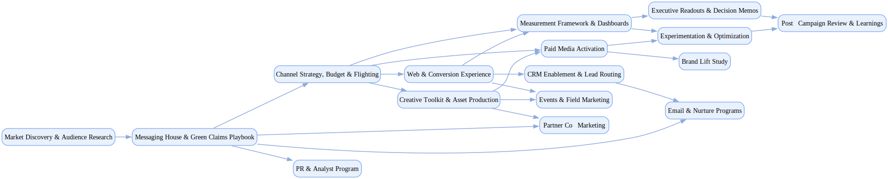

## Marketing Campaign

`tasks: 51` `constraints: 5` `team: 26` `timesteps: 55`

### Workflow Goal

!!! info "Objective"
    Objective: Launch a national integrated campaign for Acme Renewables to drive brand awareness,
                qualified pipeline for B2B (utilities, municipalities, C&I), and sign-ups for B2C community energy.

??? note "Primary deliverables"
    - Messaging house & claims playbook (substantiated, privacy-safe), brand & creative toolkit Channel plan & budget (paid/owned/earned), flighting calendar, and experimentation plan Web conversion flows (accessibility & consent), CRM and lead-routing with scoring PR & analyst program, events/field marketing kit, partner co-marketing assets Measurement framework (brand lift, funnel KPIs, CAC/LTV), MMM/MTA-compatible UTM governance

??? success "Acceptance criteria (high‑level)"
    - Brand lift ≥ +6% aided awareness within target segments; ≥ 15% MoM web organic uplift during flight ≥ 1,000 MQLs (B2B+B2C) with <= target CAC thresholds; ≥ 25 qualified opportunities for B2B Claims substantiation log maintained; no greenwashing guideline violations WCAG 2.1 AA compliance for key web assets; consent opt‑in rates ≥ 85% Experimentation cadence established; weekly executive dashboard live

### Team Structure

| Agent ID | Type | Name / Role | Capabilities |
|---|---|---|---|
| campaign_planner_ai | ai |  | Translates research to channel plan Maintains risk/dependency register Proposes weekly reallocations Tracks performance signals and trade‑offs |
| creative_director_ai | ai |  | Generates territories and briefs Enforces brand voice and inclusion Curates variant matrices Reviews creative for coherence |
| copy_optimizer_ai | ai |  | Drafts channel‑specific variants Runs A/B tests with hypotheses Checks claims against substantiation Feeds learnings back to creative |
| seo_analyst_ai | ai |  | Creates keyword clusters and pillars Plans internal links and schema Builds content backlog Aligns with ICP pain points |
| media_buyer_ai | ai |  | Configures platforms and budgets Sets frequency caps and audiences Runs canary rollouts Scales winners and prunes waste |
| analytics_ai | ai |  | Defines KPIs and event schemas Implements dashboards and alerts Designs experiments Publishes weekly readouts |
| consent_compliance_ai | ai |  | Configures CMP and opt‑ins Enforces minimization and audit trails Monitors compliance for green claims Coordinates with legal marketing |
| accessibility_checker_ai | ai |  | Checks contrast/alt/captions Flags plain‑language fixes Tracks WCAG 2.1 AA compliance Coordinates remediation |
| crm_ops_ai | ai |  | Configures scoring and routing Deduplicates and enriches Tracks SLAs Closes feedback loops |
| social_listener_ai | ai |  | Monitors sentiment and competitor moves Summarizes insights Triggers budget/creative pivots Feeds learning back to planners |
| cmo | human_mock | Chief Marketing Officer (Executive Stakeholder) | Sets objectives and KPIs Approves budgets and trade‑offs Chairs reviews and sign‑offs Balances speed/brand/compliance |
| vp_marketing | human_mock | VP Marketing (LT Member) | Owns channel staffing and cadence Publishes weekly readouts Aligns pipeline and brand goals Escalates risks and decisions |
| brand_creative_director | human_mock | Brand Creative Director (Creative Lead) | Approves territories and assets Enforces brand and inclusive tone Partners with Legal on approvals Curates design quality |
| performance_media_manager | human_mock | Performance Media Manager (Paid Media) | Owns platform setup and pacing Enforces brand safety Optimizes budgets Manages flighting |
| web_lead | human_mock | Web Experience Lead (Web/Conversion) | Builds LPs and analytics Integrates CMP/accessibility Coordinates QA and releases Tracks conversion and fixes |
| crm_lifecycle_manager | human_mock | CRM & Lifecycle Manager (Lifecycle/Email) | Designs lifecycle journeys Maintains deliverability Runs preference center Aligns with Sales/Community |
| pr_lead | human_mock | PR Lead (PR/AR) | Builds press kit and briefings Runs interviews/analyst relations Monitors coverage Coordinates with legal marketing |
| events_manager | human_mock | Events & Field Manager (Events) | Runs event/webinar production Staffs and equips teams Ensures compliant capture Closes loop with sales |
| partnerships_manager | human_mock | Partnerships Manager (Alliances/Partners) | Leads co‑marketing and MDF Coordinates partner approvals Aligns claims and assets Reports partner impact |
| data_analyst | human_mock | Marketing Data Analyst (Analytics) | Builds dashboards Runs attribution/experiments QA’s analytics Provides insights and guardrails |
| legal_marketing_counsel | human_mock | Legal Marketing Counsel (Legal (Marketing)) | Reviews claims and disclosures Approves co‑branding and PR Advises on privacy/consent Tracks approvals and exceptions |
| accessibility_specialist | human_mock | Accessibility Specialist (Accessibility) | Conducts manual WCAG audits Guides remediation Validates alt/captions/contrast Documents conformance |
| sustainability_officer | human_mock | Sustainability Officer (Sustainability) | Validates REC/LCA references Approves green claims Maintains evidence register Advises messaging house |
| sales_director | human_mock | Sales Director (B2B) (Sales) | Aligns MQL/SQL definitions Sets routing SLAs Closes sales feedback loop Tracks velocity |
| community_ops_manager | human_mock | Community Ops Manager (Community/B2C Ops) | Designs support flows Ensures compliance notices Coordinates with partners Reports enrollment KPIs |
| cmo_stakeholder | stakeholder | CMO Stakeholder (Executive) | Sets pace and quality bars Approves budgets and exceptions Chairs weekly decision forums Holds teams to measurement discipline |

### Join/Leave Schedule

| Timestep | Agents / Notes |
|---:|---|
| 0 | **cmo** — Set objectives, budget guardrails, and KPIs **vp_marketing** — Stand up cadence and org plan **campaign_planner_ai** — Translate research to initial channel plan **analytics_ai** — Define KPIs, UTM, dashboards **consent_compliance_ai** — Embed privacy-by-design up front **social_listener_ai** — Baseline sentiment and competitor activity |
| 5 | **seo_analyst_ai** — SEO roadmap; inform content pillars **brand_creative_director** — Approve messaging territories **legal_marketing_counsel** — Review green claims substantiation approach |
| 10 | **creative_director_ai** — Creative territories + briefs **copy_optimizer_ai** — Variant copy and A/B hypotheses **web_lead** — LP build plan and analytics mapping |
| 14 | **accessibility_checker_ai** — WCAG checks for assets and LPs **crm_ops_ai** — Scoring/routing/dedup config **sustainability_officer** — Validate metrics for claims |
| 18 | **pr_lead** — Press/analyst briefing program **events_manager** — Event/webinar plan and kits **partnerships_manager** — Partner co-marketing planning |
| 20 | **performance_media_manager** — Platform setup and pacing **media_buyer_ai** — Automate budgets, caps, and QA **brand_creative_director** — Final creative approvals |
| 22 | **crm_lifecycle_manager** — Nurture sequences and deliverability **sales_director** — B2B pipeline SLA alignment **community_ops_manager** — B2C enrollment support alignment |
| 28 | **data_analyst** — Executive dashboard & analysis cadence **seo_analyst_ai** — Initial roadmap delivered; ongoing items via planner |
| 35 | **analytics_ai** — Experiment design reviews and MMM/MTA alignment **campaign_planner_ai** — Weekly reallocation proposals based on results |
| 45 | **accessibility_specialist** — Manual AA audit during scale-up **copy_optimizer_ai** — Creative variants stabilized; focus on scaling |
| 55 | **media_buyer_ai** — Automation steady-state; human pacing sufficient **vp_marketing** — Transition to wrap-up and learnings |

### Workflow Diagram

[{ width=1200 }](assets/marketing_campaign.svg){ target=_blank }

### Preferences & Rubrics

Defined: Yes.

#### Sources

- Workflow: `/Users/charliemasters/Desktop/deepflow/manager_agent_gym/examples/end_to_end_examples/marketing_campaign/workflow.py`
- Team: `/Users/charliemasters/Desktop/deepflow/manager_agent_gym/examples/end_to_end_examples/marketing_campaign/team.py`
- Preferences: `/Users/charliemasters/Desktop/deepflow/manager_agent_gym/examples/end_to_end_examples/marketing_campaign/preferences.py`

