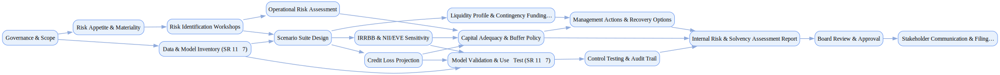

## Orsa

`tasks: 30` `constraints: 4` `team: 22` `timesteps: 50`

### Workflow Goal

!!! info "Objective"
    Objective: Produce a Board‑approved, supervisory‑ready internal risk and solvency assessment for the
                co‑operative bank/credit union. Align capital adequacy with risk profile under baseline and stressed
                conditions, demonstrate robust risk governance and model controls, and document recovery options.

??? note "Primary deliverables"
    - Risk appetite statement with quantitative limits and early‑warning indicators
    - Material risk inventory and qualitative assessment (inherent, controls, residual) with owners
    - Scenario suite and stress testing results (credit, IRRBB, liquidity, operational, climate overlay)
    - Capital plan with buffers vs NCUA RBC or CCULR leverage, plus management buffer policy
    - Model risk framework evidence (inventory, validation, challenger outcomes) per SR 11‑7
    - Liquidity adequacy analysis and contingency funding plan
    - Board package: exec summary, key findings, capital decisions, and remediation actions

### Team Structure

| Agent ID | Type | Name / Role | Capabilities |
|---|---|---|---|
| project_coordinator_ai | ai |  | Maintains assessment calendar and RAID Tracks dependencies and owners Manages documentation index/versioning Publishes status and blocker lists |
| model_inventory_ai | ai |  | Compiles model inventory Maps inputs/outputs/controls Drafts validation/challenger plans Prepares governance‑ready summaries |
| scenario_designer_ai | ai |  | Drafts macro paths and shocks Builds climate/idiosyncratic overlays Prepares variable books Aligns with governance reviewers |
| credit_modeler_ai | ai |  | Builds PD/LGD/EAD projections Designs overlays and sensitivities Prepares challenger comparisons Runs backtests and attribution |
| irrbb_modeler_ai | ai |  | Computes NII/EVE sensitivities Builds laddered reports Performs attribution analysis Checks behavioral assumptions |
| liquidity_stress_ai | ai |  | Builds liquidity stress profiles Drafts contingency funding triggers Computes survival horizons Publishes funding playbooks |
| operational_risk_ai | ai |  | Summarizes OR exposures and loss data Builds scenario add‑ons Links control gaps to remediation Quantifies capital impacts |
| validator_ai | ai |  | Runs conceptual soundness checks Performs outcomes analysis Designs ongoing monitoring Captures effective challenge evidence |
| documentation_ai | ai |  | Assembles report with citations Ensures reproducibility Maintains audit trail completeness Coordinates approvals |
| dashboard_ai | ai |  | Builds executive dashboards Prepares board materials Summarizes key findings and decisions Tracks remediation owners and ETAs |
| cro | human_mock | Chief Risk Officer (Risk Leadership) | Owns risk framework and appetite Approves scenario selection Engages board and executives Signs final decisions |
| cfo | human_mock | Chief Financial Officer (Finance Leadership) | Aligns with budget/plan Approves buffer policy Chairs finance reviews Owns financial disclosures |
| treasurer | human_mock | Treasurer (Treasury/ALM) | Owns ALM/IRRBB modeling Coordinates funding strategy Confirms ownership and data feeds Presents treasury actions |
| head_credit_risk | human_mock | Head of Credit Risk (Credit Risk) | Oversees credit models/overlays Leads segmentation and loss drivers Approves assumptions Presents results to governance |
| liquidity_risk_manager | human_mock | Liquidity Risk Manager (Liquidity Risk) | Runs liquidity stress tests Maintains CFP triggers Coordinates with Treasurer Reports survival horizons |
| operational_risk_lead | human_mock | Operational Risk Lead (Operational Risk) | Owns OR taxonomy and KRIs Manages loss data and scenarios Coordinates third‑party/fraud posture Presents OR add‑ons |
| model_risk_lead | human_mock | Model Risk/Validation Lead (Model Risk) | Owns SR 11‑7 inventory Plans validations/challengers Documents effective challenge Sets monitoring requirements |
| internal_audit | human_mock | Internal Audit (Assurance) | Audits process and controls Checks documentation and evidence Issues findings and follow‑ups Confirms remediation |
| board_risk_committee | human_mock | Board Risk Committee (Board Oversight) | Challenges methods and results Approves buffer and action choices Signs governance approvals Tracks management actions |
| regulatory_liaison | human_mock | Regulatory Liaison (Regulatory Affairs) | Coordinates with supervisors Preps exam‑ready packages Manages communications Tracks commitments and responses |
| data_governance_lead | human_mock | Data Governance Lead (Data Governance) | Owns data lineage and QC Runs change management Ensures risk data governance Preps data audit evidence |
| cro_stakeholder | stakeholder | CRO Stakeholder (Executive Stakeholder) | Sets priorities across phases Approves scenario and validation scope Demands reproducible evidence Grants final approvals |

### Join/Leave Schedule

| Timestep | Agents / Notes |
|---:|---|
| 0 | **cro** — Launch assessment; approve scope and proportionality **project_coordinator_ai** — Stand up calendar, RAID, and evidence index **data_governance_lead** — Establish data lineage and QC policy **cfo** — Align with budget/plan and board calendar |
| 5 | **model_inventory_ai** — Compile SR 11‑7 model inventory and plan validations **model_risk_lead** — Define validation and challenger scope **treasurer** — Confirm ALM/IRRBB model ownership and data feeds |
| 10 | **head_credit_risk** — Portfolio segmentation and loss-drivers **operational_risk_lead** — Operational risk taxonomy and KRIs |
| 14 | **scenario_designer_ai** — Draft macro paths and idiosyncratic/climate overlays **regulatory_liaison** — Sanity-check scenario plausibility for supervisors |
| 20 | **credit_modeler_ai** — Project credit losses and overlays **irrbb_modeler_ai** — NII/EVE sensitivity and attribution **liquidity_stress_ai** — Liquidity survival horizon and CFP |
| 26 | **dashboard_ai** — Build executive views for interim results |
| 30 | **validator_ai** — Run validation/challenger testing and monitoring design **model_inventory_ai** — Inventory stabilized; handoff to validation |
| 35 | **cfo** — Review capital buffer options vs RBC/CCULR **cro** — Set management buffer; finalize decisions |
| 40 | **documentation_ai** — Compile report with evidence links **internal_audit** — Independent assurance on controls and audit trail |
| 45 | **board_risk_committee** — Board challenge and approval **scenario_designer_ai** — Scenario set finalized; quant complete |
| 50 | **regulatory_liaison** — Package for exam; coordinate communications **validator_ai** — Validation complete; monitoring plan handed off |

### Workflow Diagram

[{ width=1200 }](assets/orsa.svg){ target=_blank }

### Preferences & Rubrics

Defined: Yes.

#### Sources

- Workflow: `/Users/charliemasters/Desktop/deepflow/manager_agent_gym/examples/end_to_end_examples/orsa/workflow.py`
- Team: `/Users/charliemasters/Desktop/deepflow/manager_agent_gym/examples/end_to_end_examples/orsa/team.py`
- Preferences: `/Users/charliemasters/Desktop/deepflow/manager_agent_gym/examples/end_to_end_examples/orsa/preferences.py`

