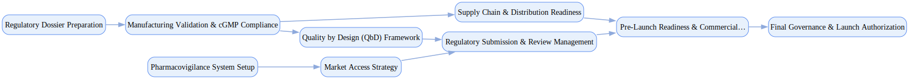

## Pharmaceutical Product Launch

`tasks: 30` `constraints: 9` `team: 18` `timesteps: 55`

### Workflow Goal

!!! info "Objective"
    Objective: Execute the launch of a new pharmaceutical product by securing regulatory approval, validating
                manufacturing and quality systems, and ensuring commercial, compliance, and supply readiness to deliver
                a safe, effective, and well-governed market entry across initial launch geographies.

??? note "Primary deliverables"
    - Regulatory dossier (eCTD format) covering all required modules (quality, safety, nonclinical, clinical)
    - submitted to FDA/EMA and aligned with ICH guidelines (Q8–Q11, M4).
    - Good Manufacturing Practice (cGMP) audit reports with validated processes, equipment qualification
    - (IQ/OQ/PQ), and lot release readiness.
    - Quality by Design (QbD) and risk management package including critical quality attributes (CQAs),
    - critical process parameters (CPPs), control strategy, and lifecycle monitoring plan.
    - Pre-Launch Activities Importation Request (PLAIR) or equivalent documentation to stage product for
    - commercial release in compliance with FDA/EMA requirements.
    - Market access strategy including payer dossiers, HTA submissions, pricing models, and early access
    - or compassionate use program approvals.
    - Distribution and supply chain readiness plan: validated logistics partners, cold-chain testing,
    - serialization/track-and-trace compliance, and inventory ramp-up.
    - Pharmacovigilance system: safety management plan, adverse event reporting pathways, signal detection
    - protocols, and risk minimization measures.
    - Governance package: decision logs, launch readiness reviews, regulatory correspondence, and board
    - sign-offs evidencing accountability at each gate.

??? success "Acceptance criteria (high-level)"
    - Regulatory agencies (FDA/EMA or local authorities) formally accept submission with no critical
    - deficiencies; first cycle review proceeds without major gaps in modules.
    - cGMP compliance confirmed by external inspection reports; no unresolved major observations.
    - QbD framework documented with linkages between CQAs, CPPs, and control strategy; reproducibility
    - demonstrated across at least three validation batches.
    - Market access plans approved by internal governance and validated by payer/HTA feedback where
    - available; launch pricing strategy documented and authorized.
    - Supply chain stress-tested with distribution partners; serialization and cold-chain controls verified.
    - Pharmacovigilance system tested with mock case processing and validated by safety/compliance team.
    - Formal sign-offs secured from Regulatory Affairs, Quality, Pharmacovigilance, Commercial, and
    - Executive Board prior to commercial release.
    - Constraints (soft):
    - Target horizon: complete launch readiness within ≤ 10 weeks of simulated effort; avoid critical path
    - stalls >5 days on regulatory or manufacturing deliverables.
    - Budget guardrail: stay within ±20% of projected regulatory, manufacturing validation, and launch
    - marketing costs absent justified scope changes.
    - Transparency: prefer proactive disclosure of known risks (e.g., supply constraints, safety signals)
    - with mitigation plans over concealment to maximize regulator and stakeholder confidence.

### Team Structure

| Agent ID | Type | Name / Role | Capabilities |
|---|---|---|---|
| regulatory_affairs_lead | ai |  | Builds eCTD dossier structure and plans Coordinates FDA/EMA interactions Maps ICH requirements to evidence Tracks questions, findings, and responses |
| manufacturing_scientist | ai |  | Designs process validation (IQ/OQ/PQ) Implements cGMP manufacturing controls Plans scale‑up and tech transfer Documents deviations and CAPA |
| quality_assurance_manager | ai |  | Defines CQAs and control strategies Validates analytical methods Runs change control and batch review Prepares inspection‑ready records |
| pharmacovigilance_specialist | ai |  | Builds RMP and case processing flows Implements signal detection protocols Coordinates adverse‑event reporting Publishes safety summaries |
| market_access_strategist | ai |  | Develops HTA submissions and value dossiers Designs pricing/reimbursement strategy Coordinates early access programs Aligns with medical and commercial |
| supply_chain_coordinator | ai |  | Implements serialization and traceability Validates cold‑chain and logistics Qualifies distribution partners Runs global launch logistics |
| clinical_data_manager | ai |  | Compiles CSRs and ISS/ISE Ensures traceability and standards Resolves data queries and discrepancies Produces benefit‑risk summaries |
| commercial_launch_manager | ai |  | Runs launch readiness reviews Coordinates sales/medical training Plans inventory and distribution Manages stakeholder engagement |
| fda_regulatory_consultant | human_mock | FDA Regulatory Consultant (FDA Regulatory Expert) | Advises on FDA pathways and guidance Preps meetings and briefing books Reviews responses and commitments Coaches for inspection readiness |
| ema_regulatory_consultant | human_mock | EMA Regulatory Consultant (EMA Regulatory Expert) | Guides EU procedures and timelines Reviews Module 1/overview materials Coordinates Q&A and day‑80/120 responses Aligns with national authorities |
| quality_control_director | human_mock | Quality Control Director (Quality Control) | Oversees analytical/release testing Maintains QC systems and data integrity Leads investigations and CAPA Prepares for regulatory inspections |
| manufacturing_operations_head | human_mock | Manufacturing Operations Head (Manufacturing Leadership) | Validates facilities and equipment Approves manufacturing readiness Oversees batch execution and release Manages deviations and improvements |
| pharmacovigilance_director | human_mock | Pharmacovigilance Director (Safety Leadership) | Approves PV systems and RMP Oversees signal detection and reporting Chairs safety governance Coordinates inspections and findings |
| medical_affairs_director | human_mock | Medical Affairs Director (Medical Leadership) | Reviews clinical claims and materials Guides scientific communications Coordinates MSL training and FAQs Oversees publication and evidence plans |
| regulatory_compliance_auditor | human_mock | Regulatory Compliance Auditor (Compliance Audit) | Plans and executes compliance audits Evaluates CAPA effectiveness Verifies documentation completeness Prepares inspection mock‑audits |
| commercial_executive | human_mock | Commercial Executive (Commercial Leadership) | Sets launch commercial objectives Balances access, price, and ethics Approves go‑to‑market plans Resolves cross‑functional trade‑offs |
| launch_steering_committee | human_mock | Launch Steering Committee (Executive Governance) | Chairs gate reviews and sign‑offs Challenges risk and readiness assumptions Allocates resources for blockers Approves final authorization |
| chief_medical_officer | stakeholder | Chief Medical Officer (Executive Stakeholder) | Balances patient safety vs speed Sets non‑negotiable guardrails Approves risk mitigations/waivers Owns final launch decision |

### Join/Leave Schedule

| Timestep | Agents / Notes |
|---:|---|
| 0 | **regulatory_affairs_lead** — eCTD dossier preparation **manufacturing_scientist** — Manufacturing validation **quality_assurance_manager** — Quality by Design framework **clinical_data_manager** — Clinical data compilation |
| 12 | **pharmacovigilance_specialist** — Pharmacovigilance system setup **supply_chain_coordinator** — Supply chain readiness |
| 20 | **fda_regulatory_consultant** — FDA submission guidance **ema_regulatory_consultant** — EMA regulatory review |
| 28 | **quality_control_director** — Quality control oversight **manufacturing_operations_head** — Manufacturing operations |
| 35 | **market_access_strategist** — Market access strategy **pharmacovigilance_director** — Safety system validation |
| 42 | **medical_affairs_director** — Medical affairs review **commercial_launch_manager** — Commercial preparation |
| 48 | **regulatory_compliance_auditor** — Compliance audit **commercial_executive** — Commercial strategy |
| 55 | **launch_steering_committee** — Launch governance and authorization |

### Workflow Diagram

[{ width=1200 }](assets/pharmaceutical_product_launch.svg){ target=_blank }

### Preferences & Rubrics

Defined: Yes.

#### Sources

- Workflow: `/Users/charliemasters/Desktop/deepflow/manager_agent_gym/examples/end_to_end_examples/pharmaceutical_product_launch/workflow.py`
- Team: `/Users/charliemasters/Desktop/deepflow/manager_agent_gym/examples/end_to_end_examples/pharmaceutical_product_launch/team.py`
- Preferences: `/Users/charliemasters/Desktop/deepflow/manager_agent_gym/examples/end_to_end_examples/pharmaceutical_product_launch/preferences.py`

