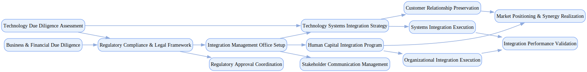

## Tech Acquisition Integration

`tasks: 43` `constraints: 0` `team: 16` `timesteps: 25`

### Workflow Goal

!!! info "Objective"
    Objective: Execute comprehensive acquisition of $150M SaaS platform company serving 50K+ enterprise customers across North America and Europe, conduct thorough technology and business due diligence, manage regulatory compliance, and achieve successful integration with retained talent and customer base within 6-month timeline.

??? note "Primary deliverables"
    - Technology due diligence package: software architecture assessment, code quality analysis, cybersecurity audit, IP ownership verification, infrastructure scalability evaluation, and technical debt quantification with integration complexity mapping.
    - Business and financial due diligence: SaaS metrics validation (ARR, churn, CAC, LTV), customer contract analysis, recurring revenue sustainability, operational workflow assessment, and competitive positioning evaluation.
    - Regulatory compliance framework: antitrust clearance coordination, HSR filing preparation, data privacy compliance verification (GDPR/CCPA), software licensing validation, and cross-border regulatory requirements.
    - Integration management office establishment: executive steering committee formation, cross-functional integration teams, governance structure definition, and project management infrastructure.
    - Technology systems integration strategy: platform compatibility roadmap, data migration planning, API integration design, security infrastructure harmonization, and service continuity protocols.
    - Human capital integration program: talent retention strategies, cultural assessment, organizational design, compensation harmonization, and leadership transition planning.
    - Customer relationship preservation: customer notification strategy, service continuity assurance, account management transition, and value proposition enhancement.
    - Market positioning and synergy realization: competitive advantage articulation, product roadmap integration, cross-selling opportunities, and revenue enhancement strategies.

??? success "Acceptance criteria (high‑level)"
    - Technology integration completed with >99.5% service uptime maintained; zero customer data loss or security incidents.
    - Key talent retention >85% for technical leadership; customer churn <5% during integration period.
    - All regulatory approvals secured without conditions; IP ownership fully validated and transferred.
    - Integration budget variance <10% of approved allocation; synergy targets achieved within 12 months.
    - Cultural integration success with unified values and collaborative workflows.
    - Post-integration revenue growth trajectory maintained or improved.
    - Constraints (soft):
    - Integration timeline: critical systems integration within 90 days, complete operational integration within 6 months.
    - Regulatory dependencies: adapt to HSR review timeline variability; maintain compliance readiness.
    - Business continuity: prioritize customer-facing system stability; maintain competitive market position.

### Team Structure

| Agent ID | Type | Name / Role | Capabilities |
|---|---|---|---|
| tech_due_diligence_lead | ai |  | Assesses architecture and code quality Evaluates cybersecurity and scalability Quantifies technical debt and risks Drafts integration complexity mapping |
| business_analyst | ai |  | Validates ARR/churn/CAC/LTV Analyzes customer contracts Assesses revenue sustainability Maps operational workflows |
| financial_analyst | ai |  | Verifies projections and assumptions Sizes market and competition Builds valuation sensitivity analyses Flags key financial risks |
| systems_integration_architect | ai |  | Designs compatibility and roadmaps Plans data migration and cutovers Defines API integration patterns Aligns security infrastructure |
| cybersecurity_specialist | ai |  | Conducts security audits and gap analysis Verifies privacy/compliance posture Designs integration security protocols Tracks remediation owners and SLAs |
| hr_integration_manager | ai |  | Designs retention and comms plans Runs cultural/organizational assessments Harmonizes comp/benefits Guides change management |
| customer_success_manager | ai |  | Plans account transitions Ensures service continuity Coordinates comms and SLAs Monitors satisfaction and risks |
| project_coordination_lead | ai |  | Establishes governance and cadence Maintains trackers and status Surfaces risks/decisions with owners Keeps artifacts consistent |
| regulatory_counsel | human_mock | Regulatory Counsel (Legal & Regulatory) | Advises on HSR strategy and filings Interfaces with regulators Coordinates timelines and waiting periods Mitigates antitrust risks |
| data_privacy_officer | human_mock | Data Privacy Officer (Privacy & Compliance) | Reviews DPAs and data transfers Sets minimization and access rules Approves integration controls Tracks remediation and notices |
| ip_legal_specialist | human_mock | IP Legal Specialist (Intellectual Property) | Validates IP ownership and OSS Drafts IP/OSS schedules Advises on consents/assignments Mitigates IP litigation risks |
| financial_controller | human_mock | Financial Controller (Financial Integration) | Oversees acquisition accounting Runs budget/synergy tracking Aligns reporting and controls Approves integration steps |
| chief_technology_officer | human_mock | Chief Technology Officer (Technology Leadership) | Approves architecture decisions Allocates technical resources Chairs design reviews Resolves high‑impact risks |
| executive_sponsor | human_mock | Executive Sponsor (Executive Leadership) | Sets success criteria and guardrails Resolves cross‑functional conflicts Approves scope and timelines Communicates status to leadership |
| target_company_ceo | human_mock | Target Company CEO (Target Leadership) | Coordinates employee communications Supports customer continuity Aligns leadership transition Confirms disclosure accuracy |
| integration_steering_committee | human_mock | Integration Steering Committee (Governance & Oversight) | Sets governance and decision rights Approves milestones and exceptions Allocates resources to unblock work Monitors integration KPIs |

### Join/Leave Schedule

| Timestep | Agents / Notes |
|---:|---|
| 0 | **tech_due_diligence_lead** — Technology architecture and security assessment **business_analyst** — SaaS metrics and customer contract validation **financial_analyst** — Financial projection and valuation verification **project_coordination_lead** — Integration management office establishment **regulatory_counsel** — Regulatory framework and compliance planning |
| 6 | **cybersecurity_specialist** — Deep security audit and compliance verification **data_privacy_officer** — GDPR/CCPA compliance and privacy framework assessment **ip_legal_specialist** — Intellectual property validation and licensing review |
| 12 | **systems_integration_architect** — Platform integration and migration planning **hr_integration_manager** — Talent retention and cultural integration strategy **financial_controller** — Financial integration and budget management |
| 18 | **customer_success_manager** — Customer relationship preservation and transition **target_company_ceo** — Employee communication and cultural integration leadership **chief_technology_officer** — Technology leadership transition and architecture approval |
| 25 | **executive_sponsor** — Strategic oversight and stakeholder communication **integration_steering_committee** — Governance, decision-making, and milestone approval |

### Workflow Diagram

[{ width=1200 }](assets/tech_acquisition_integration.svg){ target=_blank }

### Preferences & Rubrics

Defined: Unknown.

#### Sources

- Workflow: `/Users/charliemasters/Desktop/deepflow/manager_agent_gym/examples/end_to_end_examples/tech_acquisition_integration/workflow.py`
- Team: `/Users/charliemasters/Desktop/deepflow/manager_agent_gym/examples/end_to_end_examples/tech_acquisition_integration/team.py`
- Preferences: `/Users/charliemasters/Desktop/deepflow/manager_agent_gym/examples/end_to_end_examples/tech_acquisition_integration/preferences.py`

