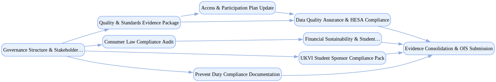

## Uk University Accreditation

`tasks: 36` `constraints: 9` `team: 16` `timesteps: 30`

### Workflow Goal

!!! info "Objective"
    Objective: Execute a structured accreditation (registration) renewal for a mid-size UK university to
                demonstrate compliance with Office for Students (OfS) ongoing conditions of registration, ensure high-quality
                academic standards, protect student interests, and maintain international student sponsorship rights.

??? note "Primary deliverables"
    - Comprehensive evidence pack against OfS conditions A–E, including mapped compliance to quality, standards,
    - governance, financial sustainability, access & participation, and student protection requirements.
    - Quality and standards matrix: course clusters mapped to B-conditions (B1–B6) with external examiner
    - summaries, continuation/completion/progression KPIs, and remediation actions.
    - Consumer law compliance audit: CMA-compliant prospectus and contracts with evidence of clear, fair, and
    - transparent information on courses, costs, and contact hours.
    - Updated Access and Participation Plan (APP) with monitoring data, gap analysis, and proposed adjustments
    - in line with OfS regulatory advice and sector benchmarks.
    - Governance package: Council, Senate, and Quality Committee minutes evidencing oversight, decisions, and
    - sign-offs; risk registers and escalation logs.
    - UKVI student sponsor compliance pack: attendance monitoring records, CAS issuance logs, and reporting
    - evidence to confirm fitness as a licensed sponsor.
    - Prevent duty documentation: risk assessment, training coverage, incident logs, and governing-body oversight
    - consistent with OfS Prevent monitoring requirements.
    - Data quality assurance pack: validated HESA Data Futures submissions, internal audit checks, and signed
    - statements of data integrity.
    - Student outcomes narrative aligned to Teaching Excellence Framework (TEF) indicators and evidence of
    - continuous improvement initiatives.

??? success "Acceptance criteria (high-level)"
    - OfS evidence pack submitted on time with no material deficiencies; ≤2 rounds of clarifications from the
    - regulator.
    - Demonstrated compliance with all quality & standards baselines (B-conditions), supported by KPIs and
    - external examiner validation.
    - APP accepted as valid and credible by OfS; demonstrable governance oversight of equality of opportunity.
    - CMA compliance confirmed by legal review; no unresolved findings on unfair terms or information clarity.
    - UKVI sponsorship compliance maintained with no major findings or risk of licence downgrade.
    - Prevent duty compliance evidenced with governing-body sign-off; training coverage ≥95% across staff.
    - HESA Data Futures submissions validated with no critical data quality flags raised.
    - Council, Senate, and Board sign-offs documented for all key evidence packs.
    - Constraints (soft):
    - Target horizon: complete renewal readiness within ≤ 8 weeks of simulated effort; avoid >5-day stalls on
    - critical-path activities (e.g., quality evidence mapping, APP submission, HESA data checks).
    - Budget guardrail: stay within ±20% of planned compliance, audit, and consultancy costs absent justified
    - scope changes.
    - Transparency: prefer proactive disclosure of known risks or weaknesses (e.g., low continuation in a
    - subject area) with mitigation plans over concealment, to maximize regulator trust and institutional
    - credibility.

### Team Structure

| Agent ID | Type | Name / Role | Capabilities |
|---|---|---|---|
| academic_quality_analyst | ai |  | Maps B‑conditions to evidence Analyzes external examiner reports Tracks outcome KPIs and trends Prepares governance‑ready summaries |
| regulatory_compliance_specialist | ai |  | Builds condition‑to‑control matrices Drafts compliant procedures and notices Coordinates UKVI and Prevent documentation Flags gaps and remediation owners |
| data_quality_manager | ai |  | Runs Data Futures validation Implements data integrity controls Coordinates internal audits Documents GDPR‑aligned governance |
| access_participation_coordinator | ai |  | Analyzes APP monitoring data Designs interventions and KPIs Drafts updates and governance packs Tracks actions to completion |
| student_protection_officer | ai |  | Audits CMA contract fairness Ensures cost transparency Maintains protection plans Coordinates student‑facing comms |
| financial_sustainability_analyst | ai |  | Runs scenario and sensitivity analysis Builds sustainability indicators Links risks to protection plans Prepares governing‑body summaries |
| governance_documentation_lead | ai |  | Builds governance document sets Maintains evidence index and traceability Coordinates approvals and sign‑offs Ensures submission readiness |
| external_quality_reviewer | human_mock | External Quality Reviewer (Independent Quality Validation) | Conducts quality reviews Benchmarks against sector norms Issues findings and recommendations Verifies action closure |
| legal_compliance_counsel | human_mock | Legal Compliance Counsel (Legal Compliance) | Reviews consumer law compliance Advises on notices/terms Checks enforcement readiness Approves remedial actions |
| data_protection_officer | human_mock | Data Protection Officer (Data Protection) | Reviews GDPR compliance Approves data sharing/retention Oversees DPIA/IG processes Tracks remediation to closure |
| internal_audit_director | human_mock | Internal Audit Director (Internal Audit) | Plans and executes audits Assesses control effectiveness Reports findings and follow‑ups Confirms remediation effectiveness |
| ukvi_compliance_manager | human_mock | UKVI Compliance Manager (Immigration Compliance) | Audits sponsor licence duties Validates status tracking/reporting Coordinates with case teams Prepares inspection evidence |
| prevent_duty_coordinator | human_mock | Prevent Duty Coordinator (Safeguarding & Prevent) | Maintains risk assessments Runs training and awareness Documents referrals/process Reviews proportionality and rights |
| senate_chair | human_mock | Senate Chair (Academic Governance) | Chairs academic approvals Ensures standards are met Tracks actions to close Balances quality and timelines |
| university_council_chair | human_mock | University Council Chair (Institutional Governance) | Oversees institutional compliance Approves submission readiness Balances risk and reputation Holds executives accountable |
| vice_chancellor | stakeholder | Vice-Chancellor (Executive Leadership) | Sets priorities and guardrails Chairs cross‑functional reviews Approves remediation plans Owns final submission decision |

### Join/Leave Schedule

| Timestep | Agents / Notes |
|---:|---|
| 0 | **academic_quality_analyst** — Quality & standards evidence compilation **regulatory_compliance_specialist** — OfS conditions mapping and compliance **data_quality_manager** — HESA data validation and quality controls **governance_documentation_lead** — Governance structure and documentation |
| 8 | **access_participation_coordinator** — Access & Participation Plan update **student_protection_officer** — Consumer law compliance and student protection |
| 12 | **ukvi_compliance_manager** — UKVI sponsor licence compliance validation **prevent_duty_coordinator** — Prevent duty compliance documentation |
| 16 | **financial_sustainability_analyst** — Financial sustainability assessment |
| 20 | **external_quality_reviewer** — Independent quality validation **legal_compliance_counsel** — Legal compliance review |
| 24 | **data_protection_officer** — Data protection and GDPR compliance review **internal_audit_director** — Internal audit and controls validation |
| 28 | **senate_chair** — Academic governance approval |
| 30 | **university_council_chair** — Final institutional approval and submission |

### Workflow Diagram

[{ width=1200 }](assets/uk_university_accreditation.svg){ target=_blank }

### Preferences & Rubrics

Defined: Yes.

#### Sources

- Workflow: `/Users/charliemasters/Desktop/deepflow/manager_agent_gym/examples/end_to_end_examples/uk_university_accreditation/workflow.py`
- Team: `/Users/charliemasters/Desktop/deepflow/manager_agent_gym/examples/end_to_end_examples/uk_university_accreditation/team.py`
- Preferences: `/Users/charliemasters/Desktop/deepflow/manager_agent_gym/examples/end_to_end_examples/uk_university_accreditation/preferences.py`

